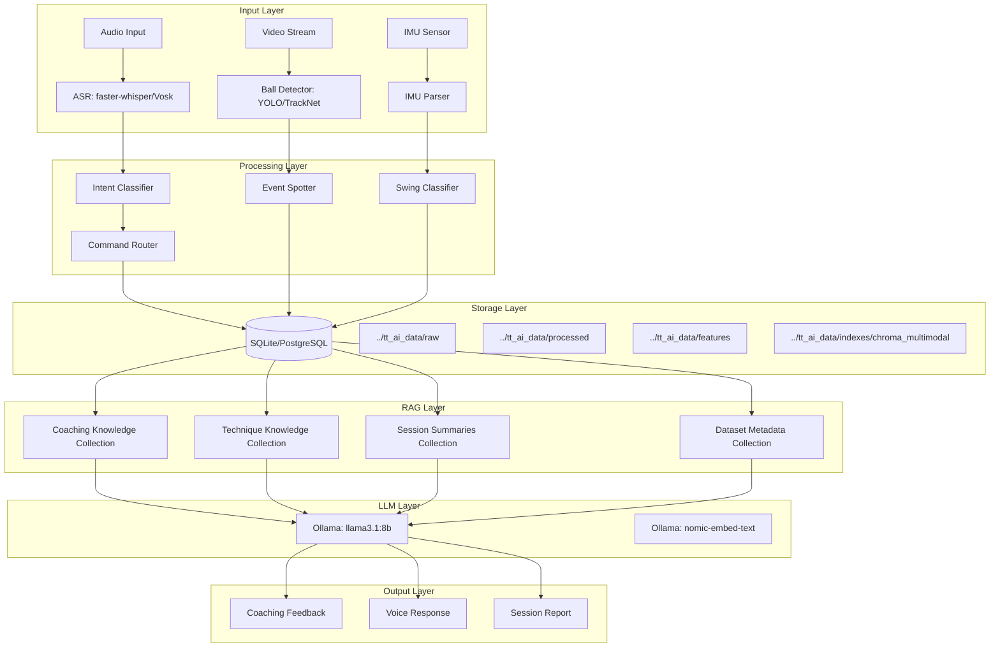
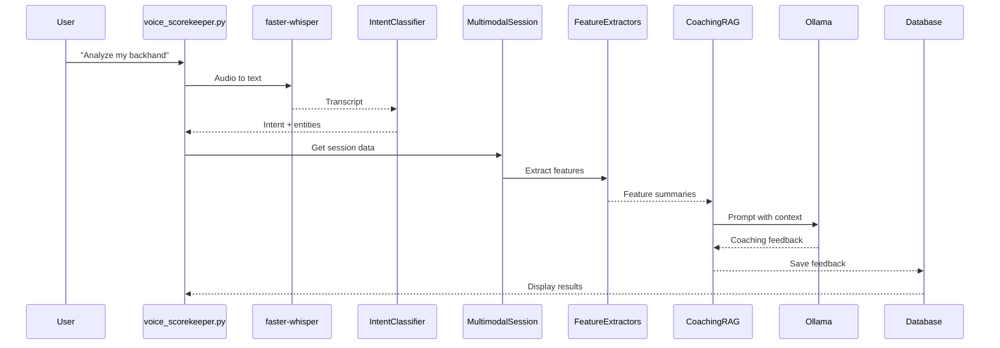

# Multimodal Voice-Enabled Table Tennis AI/Coaching System - Implementation Plan

## 1. Repository Findings

### Existing Architecture Summary

The TT-tournament platform is a well-structured Python application with:

- **Frontend**: Streamlit multi-page app with `st.navigation` (pages: dashboard, participants, events_draws, rankings, public_board, operator_console, tournament_setup, ai_assistant, voice_scorekeeper, admin)
- **Backend**: FastAPI server with async endpoints, global exception handling, and structured logging
- **Database**: SQLAlchemy ORM with Alembic migrations (SQLite, with PostgreSQL path)
- **AI Engine**: Ollama + ChromaDB RAG for match analysis and rules queries
- **Voice**: faster-whisper/Vosk for transcription, pyttsx3 for TTS, existing voice_scorekeeper page

### Current Multimodal AI Implementation Status

| Component | Status | Location |
|-----------|--------|----------|
| Dataset Registry | ✅ Implemented | `tournament_platform/multimodal_ai/dataset_registry.py` |
| Intent Classifier | ✅ Implemented | `tournament_platform/multimodal_ai/intent_classifier.py` |
| Base Adapter | ✅ Implemented | `tournament_platform/multimodal_ai/adapters/base_adapter.py` |
| Dataset Adapters | ✅ Implemented (11 adapters) | `tournament_platform/multimodal_ai/adapters/` |
| Feature Extraction Interfaces | ✅ Implemented | `tournament_platform/multimodal_ai/feature_extraction/` |
| Coaching Pipeline | ✅ Implemented (placeholder) | `tournament_platform/multimodal_ai/coaching/pipeline.py` |
| Database Models | ✅ Implemented | `tournament_platform/models.py` (lines 163-359) |
| Dataset Manifest | ✅ Implemented | `tournament_platform/multimodal_ai/manifests/datasets.yaml` |
| Config Settings | ✅ Implemented | `tournament_platform/config/__init__.py` (lines 115-125) |
| .env Variables | ✅ Implemented | `tournament_platform/.env.example` (lines 60-85) |
| .gitignore | ✅ Configured | `.gitignore` (lines 21-41) |

### Key Observations

1. **Strong Foundation**: The repository already has a solid multimodal AI infrastructure with dataset registry, adapters, and database models
2. **RAG Ready**: Existing `AIEngine` with `RulesRetriever` provides a pattern for extending to coaching knowledge
3. **License Awareness**: Dataset registry includes `LicenseType` enum and `validate_license()` method
4. **External Data Path**: Configuration uses `TT_DATA_ROOT` pointing to `../tt_ai_data` (outside repo)
5. **Missing Integration**: The coaching pipeline is a placeholder - needs RAG integration and feature extraction

---

## 2. Research Summary: How Datasets Should Be Used with Local LLMs

### 2.1 Voice Datasets

| Dataset | Local LLM Use | RAG? | Fine-tuning/Training? | Feature Extraction? |
|---------|--------------|------|----------------------|---------------------|
| **Common Voice** | ASR model adaptation (Whisper/faster-whisper) | No | Yes - ASR fine-tuning | Transcripts, speaker diarization |
| **GigaSpeech** | ASR model adaptation | No | Yes - ASR pretraining | Transcripts, audio features |
| **AMI Meeting** | Conversational ASR, turn-taking | No | Yes - ASR for far-field | Transcripts, speaker turns |
| **Fluent Speech Commands** | Intent classification training | No | Yes - Intent classifier | Command patterns, intent labels |
| **ASVspoof 2021** | Anti-spoofing model | No | Yes - Binary classifier | Spoof detection scores |
| **VoxCeleb2** | Speaker recognition | No | Yes - Speaker embedding | Speaker IDs, voice profiles |
| **IEMOCAP** | Emotion analysis | No | Yes - Emotion classifier | Emotion labels, tone features |
| **AudioSet** | Acoustic event detection | No | Yes - Event classifier | Event labels, timestamps |

### 2.2 Table Tennis Datasets

| Dataset | Local LLM Use | RAG? | Fine-tuning/Training? | Feature Extraction? |
|---------|--------------|------|----------------------|---------------------|
| **T3Set** | Coaching knowledge base | Yes - Coaching text | Yes - Stroke classifier | Stroke labels, coaching text |
| **OpenTTGames** | Event detection context | No | Yes - Ball detector | Ball positions, events |
| **Extended OpenTTGames** | Stroke subtype context | No | Yes - Stroke classifier | Stroke subtypes, outcomes |
| **BlurBall** | Ball tracking context | No | Yes - Ball detector | Ball positions, blur handling |
| **TTSwing** | Swing analysis context | No | Yes - IMU classifier | Swing phases, kinematics |
| **TT3D** | Trajectory context | No | Yes - Trajectory estimator | 3D ball paths, spin |

### 2.3 RAG Content Strategy

**Content TO Index in ChromaDB:**
- T3Set coaching text and recommendations
- Technique knowledge (stroke taxonomy, form guidelines)
- Session summaries and extracted event timelines
- Generated transcripts with context
- Dataset metadata for retrieval

**Content TO NOT Index:**
- Raw video/audio files (binary data)
- Large sensor dumps
- Copyrighted content without permission
- Personally identifiable speaker/player data

---

## 3. Dataset Usage Matrix

| Dataset | Local Use | RAG? | Fine-tuning/Training? | Feature Extraction? | Required Preprocessing | Output Artifacts | License Caution | MVP Priority |
|---------|-----------|------|----------------------|---------------------|----------------------|----------------|-----------------|--------------|
| common_voice | ASR adaptation | No | Yes (ASR) | Transcripts | Audio normalization, segmentation | Text transcripts, speaker IDs | CC0 - Safe | P0 |
| gigaspeech | ASR pretraining | No | Yes (ASR) | Transcripts | Audio filtering, segmentation | Text transcripts | Apache 2.0 - Safe | P0 |
| ami | Conversational ASR | No | Yes (ASR) | Transcripts, turns | Meeting segmentation | Text transcripts, diarization | CC BY - Attribution | P1 |
| fluent_speech_commands | Intent patterns | No | Yes (Intent) | Command labels | Audio trimming | Intent labels | MIT - Safe | P0 |
| asvspoof2021 | Spoof detection | No | Yes (Anti-spoof) | Spoof scores | Audio format conversion | Binary labels | Research-only | P2 |
| t3set | Coaching knowledge | Yes | Yes (Stroke) | Stroke labels, text | Video annotation parsing | Coaching text, stroke labels | Non-commercial | P0 |
| openttgames | Ball detection | No | Yes (Ball) | Ball positions | Video frame extraction | Ball events, trajectories | Unknown - Review | P0 |
| extended_openttgames | Stroke subtypes | No | Yes (Stroke) | Stroke subtypes | Video annotation parsing | Stroke labels, outcomes | Unknown - Review | P1 |
| blurball | Ball tracking | No | Yes (Ball) | Ball positions | Video processing | Ball events | MIT - Safe | P0 |
| ttswing | IMU analysis | No | Yes (IMU) | Swing phases | Sensor data parsing | Swing labels, kinematics | MIT - Safe | P0 |
| tt3d | Trajectory 3D | No | Yes (Trajectory) | 3D paths | Camera calibration | 3D trajectories | MIT - Safe | P1 |
| p2anet | Action detection | No | Yes (Action) | Action labels | Video processing | Action events | Unknown - Review | P2 |
| racketvision | Racket tracking | No | Yes (Racket) | Racket positions | Video processing | Racket events | Unknown - Review | P2 |
| ttst | Spin/trajectory | No | Yes (Trajectory) | Spin labels | Video processing | Spin data | Unknown - Review | P2 |
| voxceleb2 | Speaker ID | No | Yes (Speaker) | Speaker embeddings | Audio processing | Speaker IDs | Non-commercial | P2 |
| iemocap | Emotion | No | Yes (Emotion) | Emotion labels | Audio processing | Emotion labels | Non-commercial | P2 |
| audioset | Audio events | No | Yes (Events) | Event labels | Audio processing | Event labels | Research-only | P2 |
| soccernet_echoes | Commentary | No | Yes (ASR) | Transcripts | Audio processing | Sports commentary | Unknown - Review | P2 |

---

## 4. Recommended Local LLM/RAG Architecture

### 4.1 Ollama Model Recommendations

| Use Case | Model | Size | Notes |
|----------|-------|------|-------|
| Coaching Reasoning | llama3.1:8b or llama3.2:3b | 8B/3B | Good balance of reasoning and speed |
| Intent Classification | tinyllama or phi3:mini | 1-3B | Fast for real-time voice commands |
| Rules Queries | llama3:latest | 8B | Already in use, proven reliable |
| Embedding | nomic-embed-text | N/A | Already configured, good for RAG |

### 4.2 Vector Database Approach

**Recommendation: ChromaDB (existing)**
- Already integrated in the codebase
- Persistent local storage
- Ollama embedding function support
- Simple API for retrieval

**Alternative: FAISS (for performance)**
- Faster for large datasets
- No persistence built-in
- Would require additional serialization

### 4.3 Document Chunking Strategy

```
Coaching Knowledge Chunks:
- Technique descriptions: 500-1000 tokens
- Stroke taxonomy: 200-500 tokens
- T3Set coaching text: 300-800 tokens
- Session summaries: 1000-2000 tokens

Metadata Schema:
{
  "dataset_id": "t3set",
  "modality": "video",
  "task": "coaching",
  "stroke_type": "forehand",
  "session_id": "optional",
  "license": "non_commercial",
  "chunk_type": "technique_knowledge"
}
```

### 4.4 Metadata Filters

- `dataset_id` - Source dataset
- `modality` - audio, video, sensor, trajectory
- `task` - asr, intent, ball_detection, etc.
- `license` - cc0, cc_by, mit, non_commercial, research_only
- `commercial_allowed` - boolean filter
- `stroke_type` - forehand, backhand, serve, etc.
- `player_id` - anonymized reference
- `session_id` - session context

---

## 5. Data Flow Diagrams



### 5.1 Session Analysis Flow



---

## 6. Proposed File/Module Structure

```
tournament_platform/
├── multimodal_ai/
│   ├── __init__.py                    # Package exports
│   ├── dataset_registry.py            # Dataset manifest management
│   ├── intent_classifier.py           # Voice intent classification
│   ├── adapters/
│   │   ├── __init__.py
│   │   ├── base_adapter.py            # Abstract base adapter
│   │   ├── common_voice_adapter.py
│   │   ├── gigaspeech_adapter.py
│   │   ├── ami_adapter.py
│   │   ├── fluent_commands_adapter.py
│   │   ├── asvspoof_adapter.py
│   │   ├── t3set_adapter.py
│   │   ├── openttgames_adapter.py
│   │   ├── blurball_adapter.py
│   │   ├── ttswing_adapter.py
│   │   └── tt3d_adapter.py
│   ├── feature_extraction/
│   │   ├── __init__.py
│   │   ├── audio.py                   # ASR, intent, anti-spoof
│   │   ├── video.py                   # Ball detection, stroke classification
│   │   ├── sensor.py                  # IMU swing analysis
│   │   └── trajectory.py              # 3D ball path
│   ├── coaching/
│   │   ├── __init__.py
│   │   ├── pipeline.py                # CoachingPipeline class
│   │   ├── feedback.py                # Feedback templates
│   │   └── rag_indexer.py             # NEW: Index coaching knowledge
│   ├── llm/
│   │   ├── __init__.py
│   │   ├── prompts.py                 # Prompt templates
│   │   └── output_schemas.py          # Pydantic output models
│   └── schemas.py                     # Pydantic models
├── services/
│   ├── ai_engine.py                   # Extend with coaching methods
│   └── coaching_service.py            # NEW: Coaching orchestration
├── api/
│   ├── server.py                      # Add multimodal endpoints
│   └── multimodal_schemas.py          # Pydantic request/response
└── app/
    └── pages/
        ├── dataset_catalog.py
        ├── coaching_lab.py
        └── experiment_dashboard.py
```

---

## 7. API/UI Changes Needed

### 7.1 New API Endpoints

| Endpoint | Method | Request | Response | Purpose |
|----------|--------|---------|----------|---------|
| `/api/multimodal/sessions` | POST | CreateSessionRequest | SessionResponse | Create session |
| `/api/multimodal/sessions/{id}` | GET | - | SessionDetailResponse | Get session |
| `/api/multimodal/sessions/{id}/analyze` | POST | AnalyzeRequest | CoachingFeedback | Run analysis |
| `/api/multimodal/sessions/{id}/features` | GET | - | FeatureSummary | Get features |
| `/api/datasets` | GET | - | DatasetList | List datasets |
| `/api/datasets/validate` | POST | ValidationRequest | ValidationResult | Validate paths |
| `/api/rag/index` | POST | IndexRequest | IndexResult | Index content |
| `/api/rag/query` | POST | QueryRequest | QueryResponse | Query RAG |

### 7.2 Streamlit UI Enhancements

**coaching_lab.py additions:**
- Session upload (video/audio/IMU files)
- Real-time analysis toggle
- RAG context display
- Feedback history
- Export session report

**voice_scorekeeper.py additions:**
- Coaching mode toggle
- Session recording controls
- Real-time feedback display
- Voice command history

---

## 8. Prompt and JSON Schema Plan

### 8.1 Prompt Templates

```python
# Post-rally feedback prompt
POST_RALLY_PROMPT = """
You are a table tennis coach analyzing a rally.
Context: {context}
Stroke events: {stroke_events}
Ball trajectory: {trajectory}
Player: {player_name}

Provide:
1. Technical assessment (2-3 sentences)
2. One specific improvement suggestion
3. Confidence level (0-1)

Format: JSON with keys: assessment, suggestion, confidence
"""

# Session summary prompt
SESSION_SUMMARY_PROMPT = """
You are a table tennis coach summarizing a training session.
Session: {session_name}
Duration: {duration}
Strokes detected: {stroke_count}
Ball speed avg: {ball_speed_avg}

Provide:
1. Overall performance summary
2. Top 3 strengths
3. Top 3 areas for improvement
4. Recommended drills

Format: JSON with keys: summary, strengths, improvements, drills
"""

# Stroke-specific correction prompt
STROKE_CORRECTION_PROMPT = """
You are a table tennis coach correcting {stroke_type} technique.
Current form: {form_description}
Common mistakes: {mistakes}
Coaching context: {context}

Provide:
1. Specific correction for this stroke
2. Drill recommendation
3. Key point to remember

Format: JSON with keys: correction, drill, key_point
"""
```

### 8.2 JSON Output Schemas

```python
class CoachingFeedback(BaseModel):
    assessment: str
    suggestion: str
    confidence: float
    stroke_type: Optional[str] = None
    timestamp: Optional[str] = None

class SessionSummary(BaseModel):
    summary: str
    strengths: List[str]
    improvements: List[str]
    drills: List[str]
    overall_score: float

class StrokeCorrection(BaseModel):
    correction: str
    drill: str
    key_point: str
    stroke_type: str
```

---

## 9. Testing/Evaluation Plan

### 9.1 Evaluation Metrics

| Component | Metric | Target | Test Method |
|-----------|--------|--------|-------------|
| ASR | WER (Word Error Rate) | < 15% | LibriSpeech test set |
| Intent | Accuracy | > 90% | Fluent Speech Commands |
| Ball Detection | mAP@0.5 | > 80% | OpenTTGames validation |
| Stroke Classification | F1-score | > 85% | T3Set validation |
| Trajectory | RMSE (pixels) | < 10 | TT3D validation |
| RAG | Recall@5 | > 70% | Technique queries |
| Coaching | Human eval | > 4/5 | User study |

### 9.2 Test Fixtures

```
tests/fixtures/multimodal/
├── audio/
│   ├── sample_common_voice.wav
│   └── sample_fluent_commands.wav
├── video/
│   ├── sample_t3set.mp4
│   └── sample_openttgames.mp4
├── sensor/
│   └── sample_tt3d_imu.json
└── expected/
    ├── transcripts.json
    ├── intents.json
    └── features.json
```

### 9.3 Acceptance Tests

1. **Dataset Validation**: All adapters validate correctly with fixture data
2. **License Gate**: Non-commercial datasets blocked in commercial mode
3. **RAG Retrieval**: Coaching queries return relevant context
4. **Session Analysis**: End-to-end analysis produces valid feedback
5. **Privacy**: No raw data in git, no PII in RAG

---

## 10. Privacy/License/Commercial-Use Plan

### 10.1 Data Handling Rules

| Data Type | Storage | RAG | Training | Notes |
|-----------|---------|-----|----------|-------|
| Raw audio | External only | No | Yes (opt-in) | Never in git |
| Raw video | External only | No | Yes (opt-in) | Never in git |
| Transcripts | DB (anonymized) | Yes | Yes | Remove PII |
| Features | DB | Yes | Yes | Aggregated only |
| Model weights | External only | No | N/A | Never in git |
| RAG indexes | External only | N/A | N/A | Never in git |

### 10.2 License Compliance

```python
# License gate implementation
def can_use_for_training(dataset_id: str, commercial: bool) -> bool:
    dataset = registry.get_dataset(dataset_id)
    if commercial and not dataset.commercial_allowed:
        raise LicenseError(f"Dataset {dataset_id} not allowed for commercial use")
    return True
```

### 10.3 Commercial-Safe Mode

- Default: `commercial_safe_baseline` preset
- License filter: `commercial_allowed=True`
- Warning on non-commercial access
- Opt-in for research datasets

---

## 11. Phased Implementation Plan

### Phase 0: Repo Audit and Research Summary ✅
- [x] Repository structure analyzed
- [x] Existing models and endpoints documented
- [x] Architecture plan created

### Phase 1: Dataset Usage Map and Local Artifact Schema
- [ ] Create detailed dataset usage documentation
- [ ] Define normalized artifact formats
- [ ] Create test fixtures for all modalities
- [ ] Document preprocessing requirements

### Phase 2: RAG Indexing Design for Local LLM
- [ ] Create `CoachingRAGIndexer` class
- [ ] Define collection schemas
- [ ] Implement chunking strategy
- [ ] Add license filtering to RAG
- [ ] Create index refresh workflow

### Phase 3: Feature Extraction Interface Design
- [ ] Implement concrete feature extractors
- [ ] Add model loading with CPU/GPU detection
- [ ] Create feature caching layer
- [ ] Add progress tracking

### Phase 4: Local Coaching Prompt + Structured Output Contracts
- [ ] Create prompt templates module
- [ ] Define Pydantic output schemas
- [ ] Implement prompt testing
- [ ] Add deterministic mode

### Phase 5: Prototype Scripts Using Tiny Fixtures Only
- [ ] `scripts/build_multimodal_index.py`
- [ ] `scripts/extract_dataset_features.py`
- [ ] `scripts/run_local_coaching_demo.py`
- [ ] Test with fixture data

### Phase 6: Streamlit UI Plan for Local LLM Dataset Use
- [ ] Enhance coaching_lab.py with real analysis
- [ ] Add RAG context display
- [ ] Create session upload workflow
- [ ] Add feedback visualization

### Phase 7: Evaluation and Regression Tests
- [ ] Create evaluation harness
- [ ] Add license filter tests
- [ ] Add hallucination detection
- [ ] Add latency benchmarks

### Phase 8: Optional Training/Fine-Tuning Roadmap
- [ ] ASR fine-tuning pipeline
- [ ] Intent classifier training
- [ ] Ball detector training
- [ ] Stroke classifier training

---

## 12. Code Mode Handoff Checklist

### Ready for Implementation:
- [x] Dataset registry with license types
- [x] Database models for multimodal data
- [x] Intent classifier with patterns
- [x] Base adapter pattern
- [x] Feature extraction interfaces
- [x] Coaching pipeline skeleton
- [x] Configuration for external data paths
- [x] .gitignore for large data

### To Implement:
- [ ] `tournament_platform/multimodal_ai/coaching/rag_indexer.py`
- [ ] `tournament_platform/multimodal_ai/llm/prompts.py`
- [ ] `tournament_platform/multimodal_ai/llm/output_schemas.py`
- [ ] `tournament_platform/services/coaching_service.py`
- [ ] `tournament_platform/api/multimodal_schemas.py`
- [ ] `scripts/build_multimodal_index.py`
- [ ] `scripts/extract_dataset_features.py`
- [ ] `scripts/run_local_coaching_demo.py`
- [ ] Test fixtures in `tests/fixtures/multimodal/`

### Dependencies to Add (Code Mode):
- `torch` - For local model inference
- `torchvision` - For video models
- `opencv-python` - For video processing
- `numpy` - Already in requirements via pandas
- `scikit-learn` - For metrics

---

## 13. Open Questions/Blockers

1. **Dataset Access**: Do you have access to T3Set and OpenTTGames? These may require registration.

2. **Video Storage**: Should we store video paths only or implement a processing pipeline?

3. **IMU Hardware**: What IMU sensors are planned? This affects the sensor data format.

4. **3D Trajectory**: Should we focus on 2D ball tracking first, or include 3D support?

5. **Commercial Use**: Is the target deployment commercial or research-only?

6. **GPU Requirements**: Should we design for CPU-only fallback?

7. **Real-time vs Batch**: Should coaching analysis be real-time or post-session?

8. **RAG Model**: Should we use the same Ollama model for RAG and generation, or separate models?