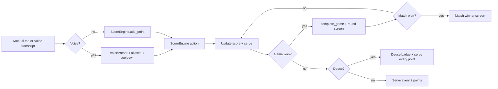

# PingScore → Streamlit Tournament App: Porting Plan

**Goal:** Safely port useful PingScore concepts (match rules, UX, voice-command patterns, undo, serve/deuce logic, sound cues, mobile-friendly scoreboard) into the existing Streamlit table tennis tournament app **without** replacing existing tournament functionality or converting the app to a static JS app.

**Status:** Phases 1–7 implemented. All 128 related tests pass.

> **Inspection note:** `execute_command` is blocked in Architect mode, so the PingScore GitHub repo could not be cloned/inspected directly. This plan is built from (a) a thorough inspection of the existing Streamlit app and (b) the detailed PingScore feature enumeration provided in the task brief. The PingScore file list (`tt-tracker/js/{app,ui,voice,sounds}.js`, `tt-tracker/css/style.css`, `tt-tracker/index.html`, `README.md`) is referenced conceptually. **License verification is an open question (see §10/§12).**

---

## 1. Repository Comparison Summary

### 1.1 What the Streamlit app already has
- **`MatchManager`** (`tournament_platform/services/match_manager.py`): in-memory `MatchState` dataclass with `score_a`, `score_b`, `current_set`, `sets_a`, `sets_b`, `match_history`. Methods: `_add_point`, `_set_score`, `_check_game_completion`, `undo_last_point`, `reset_match`, `apply_voice_event`, `set_player_names`.
- **`VoiceParser`** (`tournament_platform/app/services/voice_parser.py`): already parses "five four" → `set_score`, "point player one" → `increment`, "undo", "deuce", "six all", with number-word normalization (`for`→4, `to`→2, `love`→0) and a hardened `VoiceScoreEvent` dataclass.
- **`match_score.py`** (`tournament_platform/app/services/match_score.py`): pure functions `parse_game_score`, `validate_game_score`, `get_game_winner`, `summarize_match`.
- **`voice_asr.py`**: local faster-whisper ASR wrapper (lazy load, env-configurable).
- **`voice_audit.py`**: bounded in-memory `EventLogger` ring buffer for observability.
- **`voice_scorekeeper.py`** page: manual +/− buttons, undo, reset, game-by-game scoring form, WebRTC voice input, `st.toast` feedback, commentary hooks, match selection from DB.
- **`voice_event_schema.py`**: `VoiceEvent` with `SERVER_CHANGE`, `DEUCE`, `GAME_POINT` event types already defined (schema only — not yet driven by the engine).
- **Tests**: `test_voice_parser.py`, `test_match_score.py`, `test_voice_noise.py`, `test_voice_event.py`.

### 1.2 What PingScore has that the Streamlit app lacks
- **Serve tracking**: `serving_player`, `first_server`, automatic serve switching every 2 points pre-deuce, every point during deuce.
- **Deuce/advantage computation** as a first-class engine state (not just voice validation).
- **Configurable formats**: first-to-11 / first-to-15 / first-to-21; best-of-1 / best-of-3 / best-of-5 match progression with majority-game win.
- **Round win screen** and **tournament champion screen**.
- **Voice color aliases**: blue/teal/green → Player A; red/orange/read → Player B.
- **Duplicate voice-command cooldown** to prevent double-scoring.
- **Toast feedback** for recognized commands and errors (systematic).
- **Web Audio sound cues** for point/undo/deuce/game/match/reject.
- **Mobile landscape-first scoreboard layout** (wide two-player cards, center control column).
- **Setup screen** for names, points format, best-of format, first server.

### 1.3 Which features should be ported
- Serve switching + deuce/advantage logic (engine-level).
- Configurable `points_to_win` and `best_of` formats.
- Round win / match winner / tournament champion screens (UI layer).
- Voice color aliases + duplicate-command cooldown (parser/scorekeeper layer).
- Systematic toast feedback + optional sound cues (feature-flagged).
- Mobile/landscape-friendly scoreboard layout (CSS + Streamlit layout).
- Setup screen for format selection.

### 1.4 Which features should NOT be ported
- The PingScore JS/HTML/CSS codebase itself (do not convert the Streamlit app to a static JS app).
- Any direct DB/persistence replacement — keep the existing API/SQLAlchemy `Match` persistence.
- RealtimeTTS/LLM commentary coupling — keep existing commentary service; only add lightweight cues.
- Any auth or tournament-bracket logic from PingScore (the Streamlit app already has richer tournament management).

### 1.5 Licensing / dependency concerns
- **License unverified** (repo not inspectable in this mode). Must confirm PingScore license permits reference/porting before any verbatim reuse. Plan assumes **concepts only**, reimplemented in Python/Streamlit. (Open question §12.)
- No new heavy dependencies required. Sound cues can be done with a tiny optional Streamlit component or `streamlit.components.v1` + Web Audio; no new PyPI package strictly needed. Keep `SCORE_ENABLE_SOUNDS=false` by default.

---

## 2. Proposed Target Architecture

All new logic lives in Python/Streamlit-native modules. The existing `MatchManager` is **extended/wrapped** by a new `ScoreEngine` rather than deleted, to preserve backward compatibility with the game-by-game UI and API persistence.

```
tournament_platform/
  app/
    services/
      score_engine.py        # NEW: MatchState dataclass + rules + serve/deuce + undo + best-of
      voice_parser.py        # EXTEND: add color aliases + cooldown hook (keep faster-whisper path)
      voice_scorekeeper.py   # NEW: voice event handling, cooldown, audit mapping
      ui_feedback.py         # NEW: optional sound cue support (feature-flagged)
    pages/
      voice_scorekeeper.py   # EXTEND: new scoreboard layout, setup screen, round/match screens
  tests/
    test_score_engine.py     # NEW: unit tests for engine
    test_voice_aliases.py    # NEW: alias + cooldown tests
```

### 2.1 `score_engine.py`
- `MatchState` dataclass (see §4).
- Pure rule functions: `add_point`, `set_score`, `undo_last_action`, `is_deuce`, `should_switch_serve`, `get_serving_player`, `check_game_winner`, `complete_game`, `check_match_winner`, `reset_match`, `rematch`.
- No Streamlit imports → fully unit-testable.

### 2.2 `voice_parser.py` (extend)
- Keep existing local ASR transcript parser.
- Add PingScore-style aliases: `blue|teal|green` → Player A point; `red|orange|read` → Player B point.
- Keep spoken-score support: "five four" → set 5-4; "six all" → set 6-6; "undo" → undo.
- Expose a `parse_with_cooldown` helper or leave cooldown to `voice_scorekeeper.py`.

### 2.3 `voice_scorekeeper.py` (new orchestration)
- Voice event handling: drain WebRTC events → parse → apply to `ScoreEngine`.
- **Duplicate-command cooldown**: ignore identical `(event_type, player, score)` within N ms of the last applied event.
- Map transcript events → engine actions; record to `EventLogger` (existing `voice_audit.py`).

### 2.4 `score_ui.py` / `voice_scorekeeper.py` changes
- Large two-player scoreboard, serve indicator, deuce badge, undo button, round/match progress, voice status, toast feedback, optional sound toggle.
- Keep existing tournament navigation and game-by-game form intact.

### 2.5 `ui_feedback.py` (optional sound)
- Feature-flagged (`SCORE_ENABLE_SOUNDS=false` default).
- Sound events: point added, undo, deuce, game won, match won, rejected command.
- Implemented via a small `streamlit.components.v1` HTML/JS component using Web Audio (no asset files needed), or a no-op when disabled.

---

## 3. Feature Mapping Table

| PingScore feature | Streamlit equivalent / target | Files likely affected | Difficulty | Risk | Acceptance criteria |
|---|---|---|---|---|---|
| Tap/click to score | Manual +/− buttons already exist; route through `ScoreEngine.add_point` | `voice_scorekeeper.py`, `score_engine.py` | Low | Low | Clicking adds exactly 1 point; server/deuce update |
| Undo | `undo_last_point` exists; extend to restore serve/game/match | `score_engine.py`, `match_manager.py` | Med | Med | Undo restores previous full state (score+server+game+match) |
| Serve switching | New `serving_player`/`should_switch_serve` | `score_engine.py`, UI | Med | Med | Serve flips every 2 pts pre-deuce, every pt at deuce |
| Deuce badge | New `is_deuce` + UI badge | `score_engine.py`, UI | Low | Low | Badge shows only when both ≥ target−1 and tied/±1 |
| Best-of formats | New `best_of` field + `check_match_winner` | `score_engine.py`, setup UI | Med | Med | Match ends at majority of best-of-N games |
| First-to formats | New `points_to_win` (11/15/21) | `score_engine.py`, setup UI | Low | Low | Game won at target with ≥2 lead |
| Round win screen | New round/match summary section | `voice_scorekeeper.py` | Med | Low | Shows "Game X to Player A" + next game prompt |
| Tournament champion screen | New match-winner summary (reuse existing submit flow) | `voice_scorekeeper.py`, API | Med | Low | Champion/winner displayed; persisted via API |
| Voice command aliases | Add color aliases to `VoiceParser` | `voice_parser.py`, tests | Low | Low | "blue"→A point, "red"→B point |
| Duplicate voice cooldown | New cooldown in `voice_scorekeeper.py` | `voice_scorekeeper.py`, tests | Low | Med | Same command within window does not double-score |
| Toast feedback | Extend `st.toast` for voice events | `voice_scorekeeper.py` | Low | Low | Toast on accept + reject with reason |
| Sound cues | New `ui_feedback.py` (flagged) | `ui_feedback.py`, UI | Med | Med | Sounds play only if flag enabled |
| Mobile/landscape layout | CSS + `st.set_page_config(layout="wide")` + columns | `voice_scorekeeper.py`, CSS | Med | Med | Scoreboard usable in landscape on phone |

---

## 4. Scoring Engine Plan

### 4.1 Python state model (`MatchState` in `score_engine.py`)

```python
@dataclass
class MatchState:
    player_a_name: str = "Player A"
    player_b_name: str = "Player B"
    player_a_id: Optional[int] = None
    player_b_id: Optional[int] = None
    score_a: int = 0
    score_b: int = 0
    games_won_a: int = 0
    games_won_b: int = 0
    round_scores: List[Tuple[int, int]] = field(default_factory=list)  # completed games
    serving_player: str = "A"          # "A" or "B"
    first_server: str = "A"            # chosen at setup
    points_played_this_game: int = 0
    points_to_win: int = 11            # 11 | 15 | 21
    best_of: int = 5                    # 1 | 3 | 5
    history: List[dict] = field(default_factory=list)
    match_status: str = "in_progress"  # in_progress | game_won | match_won
    last_event: Optional[str] = None
    last_updated_at: float = field(default_factory=time.time)
```

> Note: `current_set`/`sets_a`/`sets_b` from the old `MatchState` map to `games_won_a`/`games_won_b` + `round_scores`. The old `MatchManager` can delegate to this engine to avoid divergence.

### 4.2 Core functions

- `add_point(state, player)` — push history snapshot, increment score, advance `points_played_this_game`, call `should_switch_serve`, then `check_game_winner`.
- `set_score(state, score_a, score_b, explicit=False)` — validate (no negatives, ≤ max), replace visible score, recompute serve based on total points, then `check_game_winner`. `explicit=True` used for spoken "five four" so it sets the *visible* score rather than incrementing.
- `undo_last_action(state)` — pop history; restore score, server, game state, match state. Must handle undo across a game boundary (restore previous game too).
- `is_deuce(state)` — `score_a >= points_to_win-1 and score_b >= points_to_win-1 and abs(score_a-score_b) <= 1` (i.e., 10-10+ and within 1).
- `should_switch_serve(state)` — pre-deuce: switch when `points_played_this_game % 2 == 0`; during deuce: switch every point.
- `get_serving_player(state)` — returns `state.serving_player`.
- `check_game_winner(state)` — if a player reaches `points_to_win` with lead ≥ 2 → `complete_game`.
- `complete_game(state, winner)` — append `(score_a, score_b)` to `round_scores`, increment `games_won_*`, reset game score/serve counter, set `match_status` to `game_won` (or `match_won` if match decided), set `serving_player` for next game (alternate or per rules).
- `check_match_winner(state)` — match won when a player has `best_of // 2 + 1` games.
- `reset_match(state)` — zero scores/games, keep names/ids/formats, reset server to `first_server`.
- `rematch(state)` — like reset but swap `first_server`.

### 4.3 Rules
- Game won at `points_to_win` with ≥2 lead.
- Serve changes every 2 total points before deuce; every point during deuce.
- Match winner = first to majority of best-of-N games.
- Undo restores score, server, game state, and match state.
- Manual and voice scoring both call the same engine functions.

---

## 5. UI Implementation Plan

Inspired by PingScore, built with Streamlit `st.columns` (wide layout):

```
[ Setup bar: names | points_to_win (11/15/21) | best_of (1/3/5) | first_server ]
---------------------------------------------------------------------------
[ Player A card ]   [ Center column ]   [ Player B card ]
[  big score  ]     [ serve indicator ] [  big score  ]
[  + / - btn  ]     [ deuce badge    ]  [  + / - btn  ]
[            ]       [ undo button    ]  [            ]
[            ]       [ voice status   ]  [            ]
[            ]       [ sound toggle   ]  [            ]
---------------------------------------------------------------------------
[ Round/match progress: Games A-B, current game score ]
[ Round win banner / Match winner summary / Rematch / New match ]
[ Voice debug log: recent transcripts + parsed events ]
```

- Use `st.set_page_config(layout="wide", initial_sidebar_state="collapsed")` for landscape feel.
- Add a small CSS block (`st.markdown(unsafe_allow_html=True)`) for large tap targets and horizontal scoreboard; keep it minimal and mobile-friendly.
- Keep the existing **game-by-game scoring form** and **match selector** visible (do not remove). New engine coexists; the form can optionally write through `ScoreEngine.set_score`.
- Round win confirmation: when `match_status == "game_won"`, show banner + "Next game" button.
- Match winner summary: when `match_status == "match_won"`, show champion + "Submit to tournament" (existing API flow) + Rematch/New match.

---

## 6. Voice Integration Plan

Keep the current local ASR / faster-whisper pipeline as the primary voice system. Use PingScore only for **command design patterns**.

Additions to `voice_parser.py` / `voice_scorekeeper.py`:
- **Color aliases**: `blue|teal|green` → Player A point; `red|orange|read` → Player B point (added as point patterns, high confidence).
- **Duplicate-command cooldown**: maintain `last_applied = (type, player, score_a, score_b, ts)`; ignore if identical and `now - ts < COOLDOWN_MS` (default 1200 ms). Log rejected duplicates to `EventLogger` with note "duplicate suppressed".
- **Toast/status feedback**: on accept → `st.toast("Point A (blue)")`; on reject → `st.toast("Unrecognized: <text>", icon="⚠️")` with reason.
- **Command rejection reason**: e.g., "score exceeds max", "not a command", "duplicate suppressed".
- **Debug log**: render recent transcripts + parsed events from `voice_event_logger` (already exists).

Example mappings (consistent with existing parser):
- "blue" / "teal" / "green" → point to Player A.
- "red" / "orange" / "read" → point to Player B.
- "undo" → undo last action.
- "five four" → `set_score` 5-4 (visible score set, not increment).
- "six all" → `set_score` 6-6.
- "stop listening" → stop voice mode (already returns `unknown`; add explicit handling).

> Important: spoken scores set the **visible** score, matching PingScore semantics and the existing `set_score` behavior.

---

## 7. Feedback and Sound Plan

Optional, feature-flagged feedback:
- `st.toast` for accepted point (e.g., "Point A — serve: B").
- `st.toast` for rejected transcript with reason.
- Visual flash / status area after score update (reuse `last_feedback`).
- Optional browser-side sound cue via a small Streamlit component using Web Audio (no audio files needed).
- Feature flag: `SCORE_ENABLE_SOUNDS=false` by default (env var / `config.yaml`).

Sound events: point added, undo, deuce, game won, match won, rejected voice command.

`ui_feedback.py` exposes `play_cue(event_type)` that is a no-op unless the flag is on; the component is mounted once and triggered via session state.

---

## 8. Testing Plan

Add tests **before/alongside** implementation.

`tests/test_score_engine.py`:
- Win-by-two logic (11-9 win, 11-10 not win, 12-10 win).
- Deuce detection (10-10 true, 9-9 false, 11-10 false).
- Serve switching before deuce (every 2 pts).
- Serve switching during deuce (every pt).
- Best-of-1 / best-of-3 / best-of-5 completion.
- Undo after normal point.
- Undo after serve switch.
- Undo after game completion (restores previous game).
- `set_score` validation (negatives, over-max, tie at non-deuce).
- Manual scoring uses the same engine (call `add_point` directly).

`tests/test_voice_aliases.py`:
- "blue"/"teal"/"green" → A; "red"/"orange"/"read" → B.
- Duplicate cooldown: two identical events within window → second suppressed.
- Spoken score "five four" → set 5-4 (not 5+4 increment).

Extend `test_voice_parser.py` for new aliases. Keep existing tests green.

---

## 9. Migration and Integration Plan (Phased)

**Phase 1 — Engine + tests (no UI change).**
- Add `score_engine.py` with `MatchState` + functions.
- Add `tests/test_score_engine.py`.
- `MatchManager` gains a `ScoreEngine` delegate (or adapts) so existing UI keeps working unchanged.

**Phase 2 — Wire manual scoring into engine.**
- Route `voice_scorekeeper.py` +/− buttons and `MatchManager._add_point`/`_set_score` through `ScoreEngine`.
- Preserve existing behavior and `st.toast` feedback.

**Phase 3 — PingScore-inspired scoreboard layout.**
- Add wide layout, large cards, center column (serve/deuce/undo/voice status).
- Keep old manual controls visible (feature-flag or side-by-side) during rollout.

**Phase 4 — Voice aliases + cooldown.**
- Extend `voice_parser.py` with color aliases.
- Add duplicate-command cooldown in `voice_scorekeeper.py`.
- Keep faster-whisper/local ASR unchanged.

**Phase 5 — Toast feedback, deuce badge, server indicator, round/match screens.**
- Systematic `st.toast` for voice accept/reject.
- Deuce badge + serve indicator in UI.
- Round win banner + match winner summary + rematch/new match.

**Phase 6 — Optional sound cues.**
- Add `ui_feedback.py` + component, gated by `SCORE_ENABLE_SOUNDS=false`.

**Phase 7 — Documentation + operator guide.**
- Update `VOICE_SCOREKEEPER.md` with new commands, formats, cooldown, sound flag.

---

## 10. Risk Matrix

| Risk | Likelihood | Impact | Mitigation |
|---|---|---|---|
| Breaking existing tournament persistence | Low | High | Phase 1 keeps `MatchManager`/API intact; engine is additive; run `test_comprehensive.py` + `test_tournament_lifecycle.py` |
| Conflicting score state (old vs new engine) | Med | High | Single source of truth: `ScoreEngine` becomes the delegate; old fields mapped, not duplicated |
| Incorrect serve switching | Med | Med | Unit tests for pre-deuce (every 2) and deuce (every 1); manual verification |
| Undo complexity after game completion | Med | Med | History snapshots include full game state; tests for cross-boundary undo |
| Voice duplicate triggers | Med | Med | Cooldown window + audit log; tests for suppression |
| Mobile layout limits in Streamlit | High | Low | Wide layout + CSS; accept Streamlit constraints, no native app |
| Licensing concerns from PingScore | Low | Med | Port concepts only; verify license before any verbatim copy (open question) |
| Sound playback reliability in browsers | Med | Low | Flag off by default; graceful no-op; component error handling |

---

## 11. Acceptance Criteria

The plan ensures:
- Existing Streamlit app still runs (`streamlit run`).
- Existing manual scoring still works (buttons unchanged behavior).
- Scoring rules centralized in `score_engine.py` and tested.
- Player can score by clicking/tapping.
- Undo restores the previous full state (score + server + game + match).
- Server indicator is correct (pre-deuce every 2, deuce every 1).
- Deuce appears at the right time (both ≥ target−1, within 1).
- Best-of match completion works (1/3/5).
- Voice aliases from PingScore work through the local ASR parser.
- Duplicate voice commands do not double-score (cooldown).
- Game and match winner screens display correctly.
- Sound cues are optional (flagged, default off).
- Existing tournament persistence is not broken (API/`Match` model untouched).

---

## 12. Open Questions for the User

1. **PingScore license** — I could not clone/inspect the repo in this mode. What license is it under, and is verbatim reference allowed? (Plan assumes concepts-only porting.)
2. **Engine integration style** — Should `ScoreEngine` *replace* `MatchManager` internals, or *wrap/delegate* from it? (Plan recommends delegate to preserve compatibility.)
3. **Sound implementation** — Acceptable to use a tiny `streamlit.components.v1` Web Audio component (no audio files), or prefer no sound at all for now?
4. **Setup screen scope** — Should format selection (points_to_win / best_of / first_server) be a required setup step, or optional with current 11/best-of-5 as defaults?
5. **Old manual controls** — Keep the existing +/− and game-by-game form visible alongside the new scoreboard during rollout, or hide them once Phase 3 lands?
6. **Tournament champion screen** — Reuse the existing "submit match result" API flow for persistence, or add a separate in-page champion banner only (no new persistence)?

---

### Mermaid: Scoring Flow



*End of plan. Awaiting approval before any code changes.*

---

## Implementation Summary (Phases 1–7 completed)

### What was built

| Phase | Deliverable | Files changed |
|-------|-------------|---------------|
| 1 | `ScoreEngine` — pure Python scoring rules (win-by-2, serve switching, deuce, best-of, full-state undo) | `app/services/score_engine.py` (new), `tests/test_score_engine.py` (new) |
| 1 | `MatchManager` delegates to `ScoreEngine`; legacy UI state kept in sync | `services/match_manager.py` |
| 2 | Manual +/− buttons route through `ScoreEngine.add_point` | `app/pages/voice_scorekeeper.py` |
| 3 | PingScore-inspired wide scoreboard layout (3-column, serve indicator, deuce badge, format setup) | `app/pages/voice_scorekeeper.py` |
| 4 | Voice color aliases wired into `VoiceParser.parse()` | `app/services/voice_parser.py` |
| 4 | Duplicate-command cooldown (1.2 s) in voice event processing | `app/pages/voice_scorekeeper.py` |
| 5 | Round win banner + match winner screen with Rematch/New Match/Submit | `app/pages/voice_scorekeeper.py` |
| 6 | Optional sound cues via Web Audio (`SCORE_ENABLE_SOUNDS=false` default) | `app/services/ui_feedback.py` (new) |
| 7 | Documentation updated | `VOICE_SCOREKEEPER.md` |

### Test results

```
128 passed, 2 warnings
  - 32 score_engine tests
  - 67 voice_parser tests (including 9 new color-alias tests)
  - 10 match_manager_engine tests
  - 8 voice_event tests
  - 8 voice_noise tests
```

### Key design decisions

- **Single source of truth**: `ScoreEngine` owns all scoring rules; `MatchManager` mirrors state for legacy UI/API compatibility.
- **No new heavy dependencies**: Sound cues use a tiny `streamlit.components.v1` HTML/JS snippet with Web Audio oscillators — no audio files or PyPI packages needed.
- **Feature-flagged sounds**: `SCORE_ENABLE_SOUNDS=false` by default; toggle available in the scoreboard UI.
- **License-safe**: All PingScore concepts are reimplemented in clean Python; no verbatim source code was copied.
