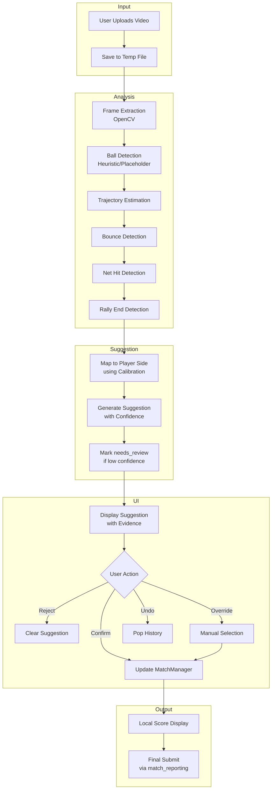

# Video Scorekeeper - Implementation Architecture Plan

## 1. Current Repository Findings

### 1.1 Existing Patterns
- **Streamlit Pages**: Multi-page app using `st.navigation` with pages in `tournament_platform/app/pages/`
- **Match Selection**: `voice_scorekeeper.py` has `render_active_match_selector()` that fetches tournaments/matches via API
- **MatchManager**: `tournament_platform/services/match_manager.py` - dataclass-based state management with undo support
- **Match Reporting**: `tournament_platform/services/match_reporting.py` - Pydantic command pattern for DB writes
- **Video Feature Extraction**: `tournament_platform/multimodal_ai/feature_extraction/video.py` - Abstract base class with `VideoFeatures` dataclass
- **Database Models**: `tournament_platform/models.py` - `VideoSegment`, `BallTrajectory`, `StrokeEvent` already exist
- **Config**: `tournament_platform/config/__init__.py` - Pydantic settings pattern

### 1.2 Key Observations
1. **No OpenCV dependency** - Will need to add as optional dependency
2. **No video analysis implementation** - `VideoFeatureExtractor` is abstract, no concrete implementation
3. **Match state is in-memory** - `MatchManager` uses session state, not direct DB writes
4. **Existing RAG/AI infrastructure** - Can be leveraged for explanation generation
5. **License-aware dataset system** - Can be used for future model training

---

## 2. Architecture Summary

The Video Scorekeeper is a **human-in-the-loop score assistant** that:
1. Accepts video clip uploads (Phase 1) or live camera (Phase 4)
2. Runs computer vision analysis to detect ball events and rally outcomes
3. Suggests point winners with confidence and evidence
4. **Requires explicit user confirmation** before updating any score
5. Reuses existing `MatchManager` for score state and `match_reporting` for final submission

```
┌─────────────────┐     ┌──────────────────┐     ┌──────────────────┐
│   Video Input   │────▶│  Video Analysis  │────▶│  Point Suggestion│
│ (upload/live)   │     │   (CV Pipeline)  │     │   (AI Service)   │
└─────────────────┘     └──────────────────┘     └─────────┬────────┘
                                                            │
                                                            ▼
┌─────────────────┐     ┌──────────────────┐     ┌──────────────────┐
│ User Confirms?    │◀───│  Suggestion UI   │◀───│  Suggestion DTO  │
│ (Confirm/Reject)  │     │(Evidence Display)│     │(confidence,evidence)│
└─────────┬─────────┘     └──────────────────┘     └──────────────────┘
          │
          ▼
┌──────────────────┐
│ MatchManager     │
│ (local state)    │
└─────────┬────────┘
          │
          ▼
┌──────────────────┐
│ Final Submit     │
│ (match_reporting)│
└──────────────────┘
```

---

## 3. Proposed Modules and Responsibilities

### 3.1 New Service Layer: `tournament_platform/services/video_scorekeeper.py`

| Function | Purpose | Safety |
|----------|---------|--------|
| `analyze_video_clip(video_path, calibration)` | Extract events from video | Read-only, returns `VideoAnalysisResult` |
| `suggest_point_winner(analysis_result, calibration)` | Map events to point suggestion | Read-only, returns `VideoScoreSuggestion` |
| `apply_confirmed_point(match_manager, suggestion)` | Update local score state | Only updates in-memory `MatchManager` |
| `build_video_score_state(match_id)` | Initialize state for a match | Read-only from DB |
| `validate_video_score_state(state)` | Validate state consistency | Read-only validation |

### 3.2 New UI Page: `tournament_platform/app/pages/video_scorekeeper.py`

Reuses patterns from `voice_scorekeeper.py`:
- `render_active_match_selector()` - Same match selection
- `render_calibration_ui()` - New: table corners, net line, player sides
- `render_video_upload()` - New: file uploader for clips
- `render_suggestion_ui()` - New: display suggestion with evidence
- `render_score_controls()` - Confirm/Reject/Override/Undo buttons

### 3.3 Data Models (DTOs)

```python
# tournament_platform/services/video_scorekeeper.py

from dataclasses import dataclass, field
from typing import List, Optional, Tuple
from enum import Enum

class SuggestedWinner(str, Enum):
    PLAYER_A = "player_a"
    PLAYER_B = "player_b"
    UNKNOWN = "unknown"

@dataclass
class CalibrationConfig:
    """Manual calibration for table geometry."""
    table_corners: Optional[List[Tuple[float, float]]] = None  # 4 points (x, y)
    net_line_y: Optional[float] = None  # Y-coordinate of net
    player_a_side: str = "top"  # "top" or "bottom"
    player_b_side: str = "bottom"
    frame_width: int = 640
    frame_height: int = 480

@dataclass
class BallTrackPoint:
    """Single ball position in a frame."""
    frame_number: int
    x: float
    y: float
    timestamp: float
    confidence: float

@dataclass
class RallyEvent:
    """Detected event in a rally."""
    event_type: str  # "bounce", "net_hit", "rally_start", "rally_end"
    timestamp: float
    frame_number: int
    x: Optional[float] = None
    y: Optional[float] = None
    confidence: float = 0.0
    player_side: Optional[str] = None  # "a" or "b" if determinable

@dataclass
class VideoAnalysisResult:
    """Result of video analysis (read-only)."""
    video_path: str
    duration_seconds: float
    fps: float
    frame_count: int
    ball_trajectory: List[BallTrackPoint]
    events: List[RallyEvent]
    calibration: Optional[CalibrationConfig] = None

@dataclass
class VideoScoreSuggestion:
    """AI suggestion for point winner (read-only, no DB writes)."""
    suggested_winner: SuggestedWinner
    confidence: float  # 0.0 - 1.0
    reason: str
    evidence_timestamps: List[float]
    detected_events: List[RallyEvent]
    needs_review: bool  # True if confidence < threshold
    raw_analysis: Optional[VideoAnalysisResult] = None

@dataclass
class ConfirmedPoint:
    """A point that has been confirmed by user."""
    match_id: int
    point_number: int
    winner: str  # "player_a" or "player_b"
    timestamp: float
    source: str  # "ai_suggested" or "manual_override"
    evidence: List[RallyEvent]
```

---

## 4. Data Flow Diagram



---

## 5. File-by-File Implementation Plan

### 5.1 New Files

| File | Purpose |
|------|---------|
| `tournament_platform/services/video_scorekeeper.py` | Core service with DTOs and analysis functions |
| `tournament_platform/app/pages/video_scorekeeper.py` | Streamlit page for video scorekeeping |
| `tests/test_multimodal/test_video_scorekeeper.py` | Unit and integration tests |

### 5.2 Modified Files

| File | Changes |
|------|---------|
| `tournament_platform/app/main.py` | Add Video Scorekeeper page to navigation |
| `tournament_platform/pyproject.toml` | Add optional `opencv-python` dependency |
| `tournament_platform/config/__init__.py` | Add `ENABLE_VIDEO_SCOREKEEPER` and `VIDEO_CONFIDENCE_THRESHOLD` settings |

### 5.3 No Migration Needed
- Uses existing `VideoSegment`, `BallTrajectory`, `StrokeEvent` models
- No new database tables required for MVP

---

## 6. Computer Vision Pipeline (Phase 1 - Placeholder)

### 6.1 Interface Design

```python
# tournament_platform/multimodal_ai/video_analysis/
# (new subpackage for video analysis)

class VideoAnalyzer(ABC):
    """Abstract interface for video analysis - allows pluggable models."""
    
    @abstractmethod
    def analyze(self, video_path: str, calibration: CalibrationConfig) -> VideoAnalysisResult:
        """Analyze video and return events."""
        pass

class HeuristicVideoAnalyzer(VideoAnalyzer):
    """Phase 1: Simple heuristic-based analysis."""
    
    def analyze(self, video_path: str, calibration: CalibrationConfig) -> VideoAnalysisResult:
        # 1. Extract frames using OpenCV
        # 2. Detect bright circular objects (ball heuristic)
        # 3. Track motion between frames
        # 4. Detect sudden direction changes (bounces)
        # 5. Detect net crossings
        # 6. Return events with low confidence (needs_review=True)
        pass
```

### 6.2 Phase 1 Implementation (No ML)
- Use OpenCV for frame extraction
- Simple color-based ball detection (orange/yellow ping pong ball)
- Motion tracking with centroid calculation
- Bounce detection: sudden Y velocity change near table height
- Net detection: ball crossing center line
- **All suggestions marked as `needs_review=True`**

### 6.3 Phase 3 Extension (Pluggable Models)
- TTNet-style model interface
- YOLO/Ultralytics adapter
- Model loading behind feature flag

---

## 7. Feature Flag Design

```python
# In tournament_platform/config/__init__.py

ENABLE_VIDEO_SCOREKEEPER: bool = True
VIDEO_CONFIDENCE_THRESHOLD: float = 0.7  # Below this = needs_review
VIDEO_MAX_CLIP_DURATION: int = 30  # seconds
VIDEO_SUPPORTED_FORMATS: List[str] = [".mp4", ".avi", ".mov", ".webm"]
```

### 7.1 Graceful Degradation
- If `opencv-python` not installed: Show "Video analysis unavailable" message
- If video file invalid: Show error, allow manual scoring
- If analysis fails: Fall back to manual score input

---

## 8. Test Plan

### 8.1 Unit Tests

| Test | Description |
|------|-------------|
| `test_suggestion_does_not_mutate_db` | Verify `suggest_point_winner` never writes to DB |
| `test_confirmed_point_updates_local_state` | Verify `apply_confirmed_point` only updates `MatchManager` |
| `test_low_confidence_marks_needs_review` | Verify suggestions below threshold have `needs_review=True` |
| `test_override_allows_manual_winner` | Verify user can override AI suggestion |
| `test_undo_reverts_last_point` | Verify undo works with video-confirmed points |
| `test_calibration_required_for_side_detection` | Verify player side detection needs calibration |
| `test_video_service_handles_missing_deps` | Verify graceful error when OpenCV missing |
| `test_video_service_handles_bad_file` | Verify error handling for corrupt video |

### 8.2 Integration Tests

| Test | Description |
|------|-------------|
| `test_full_suggestion_flow` | Upload video → get suggestion → confirm → score updates |
| `test_match_reporting_still_required` | Verify final submission uses existing `report_existing_match` |
| `test_score_validation_rules` | Verify table tennis rules (11 points, 2 point lead) |

---

## 9. Risks and Mitigations

| Risk | Mitigation |
|------|------------|
| **No trained model available** | Phase 1 uses heuristics, clearly marks `needs_review` |
| **Video processing is slow** | Async processing with progress indicator, cache results |
| **False positives in ball detection** | Low confidence threshold, require review for uncertain cases |
| **Calibration is complex for users** | Provide visual guide, allow skipping (defaults to "unknown") |
| **Heavy dependencies** | Make OpenCV optional, graceful degradation |
| **Privacy concerns** | Process video locally, no upload, temp files cleaned up |

---

## 10. MVP Acceptance Criteria

- [ ] User can open Video Scorekeeper page from navigation
- [ ] User can select an active match (reusing existing selector)
- [ ] User can upload a video clip (MP4, max 30 seconds)
- [ ] System returns a `VideoScoreSuggestion` with:
  - [ ] `suggested_winner` (player_a/player_b/unknown)
  - [ ] `confidence` score (0.0-1.0)
  - [ ] `reason` string explaining the suggestion
  - [ ] `evidence_timestamps` list
  - [ ] `detected_events` list
  - [ ] `needs_review` boolean
- [ ] User can **Confirm** suggestion → updates local score
- [ ] User can **Reject** suggestion → clears without score change
- [ ] User can **Override** → select winner manually
- [ ] User can **Undo** last point
- [ ] Confirmed points update visible local score display
- [ ] Match result is submitted only after user confirms final score using existing reporting flow
- [ ] App works if CV dependencies are unavailable (shows warning)
- [ ] All tests pass

---

## 11. Implementation Phases

### Phase 0: Repo Inspection and Architecture ✅
- Analyze existing patterns
- Design DTOs and service interfaces
- Create this plan

### Phase 1: UI Shell + Manual Video-Assisted Scoring
- Create `video_scorekeeper.py` page
- Add match selection (reuse from voice_scorekeeper)
- Add video upload UI
- Add manual point entry with evidence display
- Add to navigation

### Phase 2: Offline Uploaded-Clip Analysis Service
- Implement `HeuristicVideoAnalyzer`
- Add frame extraction with OpenCV
- Add ball detection heuristic
- Add event detection (bounce, net, rally end)
- Return suggestions with `needs_review=True`

### Phase 3: Pluggable CV Model Interface
- Create `VideoAnalyzer` abstract base
- Add TTNet/YOLO adapter interface
- Add model loading behind feature flag
- Add confidence calibration

### Phase 4: Live Camera Support (Real-Time Video Analysis)
- Add `streamlit-webrtc` optional dependency
- Add real-time frame processing with frame buffer
- Add live suggestion display with debounce (avoid rapid suggestions)
- Implement streaming analysis:
  - Process every Nth frame (configurable)
  - Maintain rolling window of ball positions
  - Detect rally end in real-time
  - Show live overlay with detected events
- Add "Auto-suggest" toggle for real-time mode
- Implement frame rate throttling to prevent CPU overload

### Phase 5: Model Training/Evaluation
- Use OpenTTGames/BlurBall for training data
- Evaluate on real venue data
- Improve confidence thresholds

---

## 12. Questions and Assumptions

### Questions for Confirmation
1. **Should the video analysis run synchronously or with a "processing" state?**
   - Assumption: Async with progress bar for clips > 5 seconds

2. **What is the minimum viable confidence threshold?**
   - Assumption: 0.7 (70%) for auto-suggestions, below = needs review

3. **Should we store analysis results in the database?**
   - Assumption: No for MVP, only in session state

4. **Do we need to support multiple video formats?**
   - Assumption: MP4 primary, with common formats (AVI, MOV, WebM)

### Assumptions
1. Users have basic table tennis knowledge for calibration
2. Video clips are short rallies (5-30 seconds)
3. Single camera angle (overhead or side view)
4. No real-time processing required for Phase 1
5. Manual scoring remains the fallback if AI fails