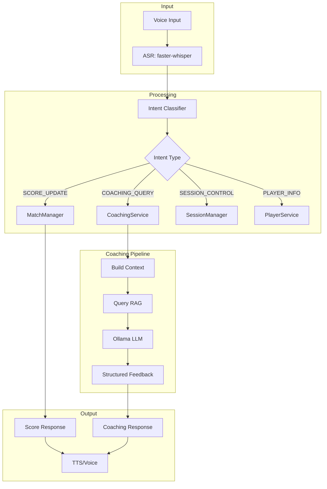

# Voice Scorekeeper Coaching Improvements Plan

## 1. Current Voice Scorekeeper Analysis

### 1.1 Existing Implementation
The `voice_scorekeeper.py` page currently provides:
- **Voice Input**: `st.audio_input` for recording
- **ASR**: `UmpireEngine.transcribe_audio_file()` using faster-whisper
- **Intent Parsing**: `MatchManager.update_score()` with keyword matching (NOT using `IntentClassifier`)
- **TTS**: `pyttsx3` for offline voice feedback
- **Match Management**: Player selection, score display, match state

### 1.2 Key Gaps for Coaching
1. **No Intent Classification**: Uses keyword matching instead of the existing `IntentClassifier`
2. **No Coaching Mode**: Only supports scorekeeping, not technique analysis
3. **No Session Recording**: Cannot record and analyze training sessions
4. **No RAG Integration**: Coaching knowledge not accessible
5. **No Feature Extraction**: Video/IMU/trajectory data not processed

---

## 2. Voice Scorekeeper Coaching Enhancement Plan

### 2.1 Core Integration Points

| Component | Current | Target | File |
|-----------|---------|--------|------|
| Intent Classification | Keyword matching in MatchManager | Use `IntentClassifier` | `voice_scorekeeper.py` |
| Coaching Mode | Not present | Toggle between scorekeeping/coaching | `voice_scorekeeper.py` |
| Session Management | Not present | Record/analyze sessions | `voice_scorekeeper.py` + `coaching_service.py` |
| RAG Context | Not used | Query coaching knowledge | `umpire_engine.py` + `coaching_service.py` |
| Feedback Display | Text only | Structured JSON + voice | `voice_scorekeeper.py` |

### 2.2 Session State Additions

```python
# Add to voice_scorekeeper.py session state initialization
if 'coaching_mode' not in st.session_state:
    st.session_state.coaching_mode = False
if 'current_session_id' not in st.session_state:
    st.session_state.current_session_id = None
if 'session_recording' not in st.session_state:
    st.session_state.session_recording = False
if 'coaching_history' not in st.session_state:
    st.session_state.coaching_history = []
if 'intent_classifier' not in st.session_state:
    st.session_state.intent_classifier = IntentClassifier()
```

---

## 3. Implementation Phases

### Phase 1: Intent Classification Integration
**Goal**: Replace keyword matching with `IntentClassifier`

**Changes to `voice_scorekeeper.py`**:
- Import `IntentClassifier` and `IntentType`
- Initialize `IntentClassifier` in session state
- Modify `process_voice_command()` to:
  1. Transcribe audio with `UmpireEngine`
  2. Classify intent with `IntentClassifier`
  3. Route to appropriate handler:
     - `SCORE_UPDATE` → `MatchManager.update_score()`
     - `COACHING_QUERY` → `CoachingService.generate_feedback()`
     - `SESSION_CONTROL` → Session start/stop
     - `PLAYER_INFO` → Player stats lookup

### Phase 2: Coaching Mode UI
**Goal**: Add coaching mode toggle and session controls

**UI Additions**:
```
🎤 Voice Scorekeeper
[Scorekeeping Mode] [Coaching Mode] ← Toggle

In Coaching Mode:
- "Start Session" / "Stop Session" buttons
- "Analyze my backhand" voice command
- Real-time feedback display
- Session history panel
```

### Phase 3: Coaching Service Integration
**Goal**: Connect voice commands to coaching pipeline

**Changes to `coaching_service.py`**:
- Add `generate_coaching_response()` method
- Integrate with `AIEngine` for RAG queries
- Add coaching prompt templates
- Return structured `CoachingFeedback`

### Phase 4: UmpireEngine Coaching Extension
**Goal**: Add coaching system prompt to `UmpireEngine`

**Changes to `umpire_engine.py`**:
- Add `_coaching_system_prompt` for technique analysis
- Add `process_coaching_query()` method
- Route coaching queries to `CoachingService`

### Phase 5: Session Recording & Analysis
**Goal**: Record and analyze training sessions

**Features**:
- Session start/stop via voice commands
- Audio transcript accumulation
- Feature extraction trigger on session end
- RAG-based feedback generation

---

## 4. Voice Scorekeeper Coaching Flow



---

## 5. Specific Code Changes

### 5.1 `voice_scorekeeper.py` - Intent Integration

```python
# Add import
from tournament_platform.multimodal_ai.intent_classifier import IntentClassifier, IntentType

# Modify process_voice_command
def process_voice_command(audio_bytes: bytes) -> Tuple[str, str, IntentType]:
    # Transcribe
    transcript = st.session_state.umpire_engine.transcribe_audio_file(temp_path)
    
    # Classify intent
    intent_result = st.session_state.intent_classifier.classify(transcript)
    
    if intent_result.intent_type == IntentType.COACHING_QUERY:
        # Route to coaching service
        feedback = st.session_state.coaching_service.generate_feedback(
            session_id=st.session_state.current_session_id,
            query=transcript,
            entities=intent_result.entities
        )
        return transcript, feedback.feedback_text, intent_result.intent_type
    
    elif intent_result.intent_type == IntentType.SESSION_CONTROL:
        # Handle session start/stop
        action = intent_result.entities.get("action")
        if action == "start":
            st.session_state.session_recording = True
            st.session_state.current_session_id = str(uuid.uuid4())
        elif action == "stop":
            st.session_state.session_recording = False
        return transcript, f"Session {action}ed", intent_result.intent_type
    
    # Default: score update
    success, response = st.session_state.match_manager.update_score(transcript)
    return transcript, response, intent_result.intent_type
```

### 5.2 `coaching_service.py` - RAG Integration

```python
# Add to CoachingService
def generate_feedback(
    self,
    session_id: Optional[str] = None,
    query: str = "",
    entities: Optional[Dict] = None
) -> CoachingFeedback:
    """Generate coaching feedback from voice query."""
    # Build context from query and entities
    context = self._build_coaching_context(query, entities)
    
    # Query RAG for relevant techniques
    rag_context = self.ai_engine.query_with_context(
        query=query,
        collection="technique_knowledge",
        filters={"stroke_type": entities.get("stroke_type", "all")}
    )
    
    # Generate response with LLM
    prompt = COACHING_QUERY_PROMPT.format(
        query=query,
        context=rag_context,
        stroke_type=entities.get("stroke_type", "unknown")
    )
    
    response = ollama.chat(
        model=self.config.ollama_model,
        messages=[
            {"role": "system", "content": self._coaching_system_prompt},
            {"role": "user", "content": prompt}
        ]
    )
    
    return self._parse_coaching_response(response['message']['content'])
```

### 5.3 `umpire_engine.py` - Coaching Prompt

```python
# Add to UmpireEngine
_coaching_system_prompt = (
    "You are a table tennis technique coach. "
    "Provide specific, actionable feedback on stroke technique. "
    "Focus on form, footwork, and racket angle. "
    "Keep responses concise and under 50 words. "
    "If you need more information, ask for clarification."
)
```

---

## 6. Coaching Voice Commands

| Command | Intent | Entities | Action |
|---------|--------|----------|--------|
| "Analyze my backhand" | COACHING_QUERY | stroke_type=backhand | Generate backhand feedback |
| "How's my forehand?" | COACHING_QUERY | stroke_type=forehand | Generate forehand feedback |
| "Start session" | SESSION_CONTROL | action=start | Begin recording |
| "Stop session" | SESSION_CONTROL | action=stop | End and analyze |
| "What's my rating?" | PLAYER_INFO | - | Show player stats |
| "Player A wins point" | SCORE_UPDATE | player=Player A | Update score |

---

## 7. Testing Strategy

### 7.1 Unit Tests
- `test_intent_routing.py`: Test intent classification routing
- `test_coaching_service.py`: Test feedback generation
- `test_session_recording.py`: Test session lifecycle

### 7.2 Integration Tests
- Voice command to feedback end-to-end
- Session recording and analysis flow
- RAG query with coaching context

### 7.3 Acceptance Criteria
1. Voice command "Analyze my backhand" returns structured feedback
2. Session start/stop works via voice
3. Coaching mode toggle switches UI modes
4. No PII in RAG responses
5. License filtering works for non-commercial datasets

---

## 8. Code Mode Handoff Checklist

- [ ] Import `IntentClassifier` in `voice_scorekeeper.py`
- [ ] Add `coaching_mode` session state
- [ ] Modify `process_voice_command()` to use intent classification
- [ ] Add coaching mode UI elements
- [ ] Extend `UmpireEngine` with coaching prompt
- [ ] Implement `generate_coaching_response()` in `CoachingService`
- [ ] Add session recording state management
- [ ] Create test fixtures for coaching voice commands
- [ ] Add RAG query integration for technique knowledge