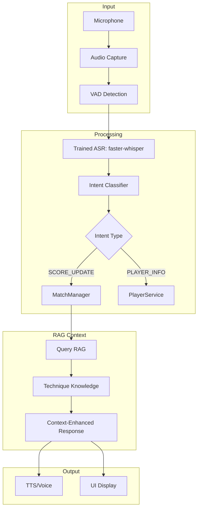

# Voice Scorekeeper Dataset Training Plan for Real-Time Scorekeeping

## 1. Current Voice Scorekeeper Analysis

### 1.1 Existing Implementation
The `voice_scorekeeper.py` page currently provides:
- **Voice Input**: `st.audio_input` for one-shot recording
- **ASR**: `UmpireEngine.transcribe_audio_file()` using faster-whisper
- **Intent Parsing**: `MatchManager.update_score()` with keyword matching
- **TTS**: `pyttsx3` for offline voice feedback
- **Match Management**: Player selection, score display, match state

### 1.2 Key Gaps
1. **No Intent Classification**: Uses keyword matching instead of `IntentClassifier`
2. **No Dataset Training**: Not using public datasets for model improvement
3. **No Real-Time Feedback**: No live commentary during match
4. **No Confidence Scoring**: No quality metrics for transcriptions

---

## 2. Dataset Usage for Real-Time Scorekeeping

### 2.1 Voice Datasets for ASR Training

| Dataset | Use Case | Training Target | Output |
|---------|----------|-----------------|--------|
| Common Voice | ASR adaptation | faster-whisper fine-tuning | Better table tennis term recognition |
| GigaSpeech | ASR pretraining | Whisper model | General speech recognition |
| AMI Meeting | Conversational ASR | Speaker diarization | Multi-speaker match commentary |
| Fluent Speech Commands | Intent patterns | Intent classifier | Score update command recognition |
| ASVspoof 2021 | Anti-spoofing | Spoof detection | Filter out fake audio |

### 2.2 Table Tennis Datasets for Context

| Dataset | Use Case | Training Target | Output |
|---------|----------|-----------------|--------|
| T3Set | Coaching text | RAG knowledge base | Technique terminology |
| OpenTTGames | Event detection | Event spotter | Ball event context |
| BlurBall | Ball tracking | Ball detector | Ball position context |
| TTSwing | Swing analysis | IMU classifier | Swing phase context |
| TT3D | Trajectory context | Trajectory estimator | Ball path context |

---

## 3. Local LLM Training Strategy

### 3.1 ASR Model Adaptation
**Using Common Voice + GigaSpeech:**
- Fine-tune faster-whisper on table tennis terminology
- Add TABLE_TENNIS_TERMS to initial prompt
- Target: Better recognition of "score", "point", "game", player names

**Training Script:**
```python
# scripts/train_asr.py
from faster_whisper import WhisperModel
from tournament_platform.multimodal_ai.adapters.common_voice_adapter import CommonVoiceAdapter
from tournament_platform.multimodal_ai.adapters.gigaspeech_adapter import GigaSpeechAdapter

def prepare_training_data():
    # Load Common Voice transcripts
    cv_adapter = CommonVoiceAdapter()
    cv_data = cv_adapter.load_transcripts()
    
    # Load GigaSpeech transcripts
    gs_adapter = GigaSpeechAdapter()
    gs_data = gs_adapter.load_transcripts()
    
    # Filter for sports/score related content
    training_data = filter_score_related(cv_data + gs_data)
    return training_data

def fine_tune_whisper(training_data):
    model = WhisperModel("base", device="cuda")
    # Fine-tune on table tennis scorekeeping commands
    model.finetune(training_data, output_dir="../tt_ai_data/models/whisper_scorekeeper")
```

### 3.2 Intent Classifier Training
**Using Fluent Speech Commands:**
- Train intent classifier on score update patterns
- Extract command patterns for score updates
- Target: Better classification of score commands

**Training Script:**
```python
# scripts/train_intent_classifier.py
from tournament_platform.multimodal_ai.adapters.fluent_commands_adapter import FluentCommandsAdapter
from tournament_platform.multimodal_ai.intent_classifier import IntentClassifier

def train_intent_classifier():
    adapter = FluentCommandsAdapter()
    commands = adapter.load_commands()
    
    # Extract score-related patterns
    score_patterns = extract_score_patterns(commands)
    
    # Update INTENT_PATTERNS in IntentClassifier
    IntentClassifier.update_patterns(score_patterns)
```

### 3.3 RAG Knowledge Base
**Using T3Set + OpenTTGames:**
- Index coaching text and technique knowledge
- Add table tennis terminology to RAG
- Target: Better context for score interpretation

**Indexing Script:**
```python
# scripts/index_rag.py
import chromadb
from tournament_platform.multimodal_ai.adapters.t3set_adapter import T3SetAdapter
from tournament_platform.multimodal_ai.adapters.openttgames_adapter import OpenTTGamesAdapter

def index_technique_knowledge():
    client = chromadb.PersistentClient(path="../tt_ai_data/indexes/chroma_multimodal")
    
    # Index T3Set coaching text
    t3set = T3SetAdapter()
    coaching_texts = t3set.load_coaching_text()
    client.get_collection("technique_knowledge").add(
        documents=coaching_texts,
        metadatas=[{"dataset": "t3set", "type": "coaching"} for _ in coaching_texts]
    )
    
    # Index OpenTTGames event context
    opentt = OpenTTGamesAdapter()
    event_contexts = opentt.load_event_contexts()
    client.get_collection("event_context").add(
        documents=event_contexts,
        metadatas=[{"dataset": "openttgames", "type": "events"} for _ in event_contexts]
    )
```

---

## 4. Real-Time Scorekeeping Flow with Trained Models



---

## 5. Implementation Phases

### Phase 1: Dataset Integration
**Goal**: Load and validate datasets for training

**Tasks:**
- [ ] Create dataset validation script
- [ ] Load Common Voice for ASR training
- [ ] Load Fluent Speech Commands for intent training
- [ ] Load T3Set for RAG knowledge

### Phase 2: ASR Model Training
**Goal**: Fine-tune faster-whisper on table tennis commands

**Tasks:**
- [ ] Extract table tennis terminology
- [ ] Prepare training data from Common Voice
- [ ] Fine-tune Whisper model
- [ ] Evaluate on scorekeeping commands

### Phase 3: Intent Classifier Training
**Goal**: Improve intent classification for score updates

**Tasks:**
- [ ] Extract score patterns from Fluent Speech Commands
- [ ] Update `IntentClassifier` patterns
- [ ] Test classification accuracy

### Phase 4: RAG Integration
**Goal**: Add technique knowledge to RAG

**Tasks:**
- [ ] Index T3Set coaching text
- [ ] Add event context from OpenTTGames
- [ ] Query RAG in real-time

### Phase 5: Real-Time UI
**Goal**: Add real-time controls and feedback

**Tasks:**
- [ ] Add push-to-talk button
- [ ] Add continuous mode toggle
- [ ] Add audio level indicator
- [ ] Add real-time transcript display

---

## 6. Dataset-to-LLM Mapping

| Dataset | Model | Training Type | Output |
|---------|-------|---------------|--------|
| Common Voice | faster-whisper | Fine-tuning | ASR model |
| GigaSpeech | faster-whisper | Pretraining | ASR model |
| Fluent Speech Commands | IntentClassifier | Pattern extraction | Intent patterns |
| T3Set | ChromaDB | RAG indexing | Technique knowledge |
| OpenTTGames | ChromaDB | RAG indexing | Event context |

---

## 7. Code Mode Handoff Checklist

- [ ] Create `scripts/train_asr.py` for Whisper fine-tuning
- [ ] Create `scripts/train_intent_classifier.py` for pattern extraction
- [ ] Create `scripts/index_rag.py` for knowledge base
- [ ] Update `IntentClassifier` with trained patterns
- [ ] Add dataset loading to `voice_scorekeeper.py`
- [ ] Add real-time mode toggle
- [ ] Add audio level indicator
- [ ] Add RAG query integration
- [ ] Create test fixtures for trained models