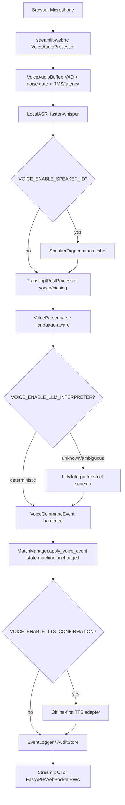

# Voice Scorekeeper — Future-Enhancements Implementation Roadmap

> Scope: A safe, phased architecture plan for extending the local-first, Streamlit-based
> voice-powered table-tennis scorekeeper. This document is **planning only** — no code
> changes are made here. It is the prerequisite for a later implementation pass.

> **Implementation directive (user, 2026-07-07):** Implement the plan, but **EXCLUDE
> Phase 3 (Multilingual Scoring)**. All other phases (1, 2, 4, 5, 6, 7, 8, 9) remain in
> scope. The `VOICE_ENABLE_MULTILINGUAL` flag and multilingual parser/ASR work are not
> built. The event schema still carries a `language` field (default `"en"`) for future
> use, but no language dictionaries or multilingual models are added.

---

## 1. Repository Inspection Summary

### 1.1 What already exists (baseline is implemented)

The baseline described in the task has already been built. The relevant modules are:

| Concern | Location | Notes |
|---------|----------|-------|
| Streamlit entry point | `tournament_platform/app/main.py`, `tournament_platform/app/pages/voice_scorekeeper.py` (~1590 lines) | Multi-page app; voice page is the active-match screen. |
| Audio capture / VAD | `tournament_platform/app/services/voice_audio.py` | `VoiceAudioBuffer` + `AudioChunk` dataclass. Amplitude-based silence detection, mono 16 kHz conversion. |
| Local ASR | `tournament_platform/app/services/voice_asr.py` | `LocalASR` wraps faster-whisper, lazy-loaded, env-overridable. `transcribe_chunk()` hardcodes `language="en"`. |
| Parser / event object | `tournament_platform/app/services/voice_parser.py` | `VoiceParser` + `VoiceScoreEvent` dataclass. English-only `_NUMBER_WORDS`. |
| State machine / game logic | `tournament_platform/services/match_manager.py` | `MatchManager` + `MatchState`. `apply_voice_event()`, `_add_point()`, `_set_score()`, `undo_last_point()`, `_check_game_completion()`. |
| Pure scoring utils | `tournament_platform/app/services/match_score.py` | `validate_game_score`, `parse_game_score`, `summarize_match`. |
| Rich event schema (unused in real-time path) | `tournament_platform/services/voice_event_schema.py` | `VoiceEvent` (Pydantic) + `EventType` + `EventFactory`. Has timestamp, confidence, source_transcript, entities, requires_confirmation — but only used by commentary / match-result paths. |
| Persistence | `tournament_platform/models.py` (SQLAlchemy), `tournament_platform/api/server.py` (FastAPI), `tournament_platform/app/api_client.py` | `MatchManager` is **in-memory** (session state). Match results submitted via API. |
| Config / env | `tournament_platform/config/__init__.py` (`Settings`), `tournament_platform/services/settings.py` (feature flags), `tournament_platform/.env.example` | Flags: `ENABLE_VOICE_ENTRY`, `ENABLE_SPOKEN_CONFIRMATION`, `KEEP_AUDIO_FILES`, `SPEECH_MODEL_SIZE`. ASR reads `VOICE_ASR_*` directly from `os.environ`. |
| TTS (partial) | `voice_scorekeeper.py::speak_text()` | `pyttsx3`, **blocking**, not wired to confirmation modes. |
| Intent classifier (unused in real-time path) | `tournament_platform/multimodal_ai/intent_classifier.py` | Regex `IntentClassifier`; used by push-to-talk path, not the WebRTC path. |
| Tests | `tests/test_voice_parser.py`, `tests/test_multimodal/test_voice_event_schema.py`, `tests/test_multimodal/test_voice_scorekeeper.py`, `tests/test_match_score.py`, `tests/test_live_scoring.py` | Good parser coverage; schema tests exist. |
| Deps | `pyproject.toml` (main + `live` extras for streamlit-webrtc), `tournament_platform/requirements.txt` | `faster-whisper`, `RealtimeTTS`, `vosk`, `pyttsx3` already present. |
| Docs | `VOICE_SCOREKEEPER.md`, `ARCHITECTURE.md`, `README.md`, `QUICKSTART.md`, `TROUBLESHOOTING.md` | Voice doc is current and accurate. |

### 1.2 Key findings (gaps that the enhancements must fill)

1. **Event object is under-specified for advanced features.** The real-time path uses
   `VoiceScoreEvent` (dataclass) with only: `type`, `score_a`, `score_b`, `player`,
   `raw_text`, `confidence`. It is **missing** `timestamp`, `source` (asr/llm/manual),
   `uncertainty`, `speaker_label`, `language`, `requires_confirmation`, `event_id`.
   The richer `VoiceEvent` Pydantic model exists but is **not** used by the live scoring path.
2. **`_process_voice_events()` in `voice_scorekeeper.py` (lines ~288-337) hand-builds a
   log dict** with only `event_type/score_a/score_b/player` — no timestamp, confidence,
   source, or speaker. This is the single integration seam every enhancement must touch.
3. **ASR is English-locked** (`language="en"`), so multilingual (Phase 3) requires a model +
   parser change, not just config.
4. **No noise telemetry** — `VoiceAudioBuffer` tracks silence but not RMS/energy/latency,
   so calibration (Phase 5) and observability (Phase 9) have nothing to record.
5. **TTS is blocking and unconfirmed** — risk of audio feedback into the mic (Phase 4).
6. **No speaker concept anywhere** — Phase 2 needs a new field + optional tagger.
7. **Core logic is already mostly decoupled** (parser/asr/audio/match_manager are importable
   without Streamlit), which makes Phase 8 (mobile/web) feasible without a rewrite.

---

## 2. Proposed Architecture Changes

### 2.1 Target pipeline (all enhancements, modular + feature-flagged)

```text
Browser Microphone
  → streamlit-webrtc  VoiceAudioProcessor.recv_audio()
    → VoiceAudioBuffer            [VAD + noise gate + RMS/latency tracking]   (Phase 5)
      → LocalASR                  [multilingual model when enabled]           (Phase 3)
        → [optional] SpeakerTagger.attach_label()                            (Phase 2)
        → [optional] NoiseFilter.reject_or_pass()                            (Phase 5)
        → TranscriptPostProcessor  [vocab / biasing / normalization]          (Phase 6)
          → VoiceParser.parse(language=...)                                  (Phase 3)
            → [optional] LLMInterpreter.fallback()  [strict schema]          (Phase 7)
              → VoiceCommandEvent  [HARDENED schema: timestamp, source,       (Phase 1/9)
                                    uncertainty, speaker, language,
                                    requires_confirmation, event_id]
                → MatchManager.apply_voice_event()  [state machine UNCHANGED]
                  → TTSConfirmationAdapter.speak()  [offline-first, modes]    (Phase 4)
                  → EventLogger / AuditStore       [structured, exportable]   (Phase 9)
                  → Streamlit UI  (and later FastAPI + WebSocket/PWA)         (Phase 8)
```

### 2.2 Mermaid flow



### 2.3 Core recommendation: harden the event schema first

Introduce a single hardened command event used by the real-time path. Keep it backward
compatible with the existing `VoiceScoreEvent` so the parser and state machine do not break.

**Option A (recommended): extend `VoiceScoreEvent` in place (additive fields).**
Add optional fields with safe defaults: `timestamp: float`, `source: str = "asr"`,
`uncertainty: float = 0.0`, `speaker_label: Optional[str] = None`,
`language: str = "en"`, `requires_confirmation: bool = False`, `event_id: str`,
`asr_latency_ms: Optional[float] = None`, `noise_rms: Optional[float] = None`.
`MatchManager.apply_voice_event()` already only reads `type/score_a/score_b/player`, so
adding fields is non-breaking.

**Option B (cleaner long-term): new `VoiceCommandEvent` dataclass** in a new
`voice_event.py`, with `VoiceScoreEvent` kept as a thin alias/adapter during transition.

Either way, bridge to the existing Pydantic `VoiceEvent` only at the audit/observability
boundary (Phase 9), so the rich schema is reused for export without coupling the hot path.

### 2.4 Safe extension points (do not refactor unless needed)

| Extension point | File | How to extend safely |
|-----------------|------|----------------------|
| Parser entry | `voice_parser.py::VoiceParser.parse` | Add optional kwargs `language`, `speaker_label`, `source` (default unchanged). Keep English behavior identical. |
| ASR transcription | `voice_asr.py::LocalASR.transcribe_chunk` | Add `language` and `initial_prompt` params; default to current `en` behavior. |
| Audio buffering | `voice_audio.py::VoiceAudioBuffer` | Add RMS/energy tracking, configurable thresholds, `calibrate()` method. Keep existing emit logic. |
| State-machine entry | `match_manager.py::apply_voice_event` | Single funnel for all commands. Add `requires_confirmation` handling only. |
| Integration seam | `voice_scorekeeper.py::_process_voice_events` | Attach speaker/LLM/TTS/observability hooks here; this is where hardened events are built. |
| Config | `services/settings.py` + `config/__init__.py` + `.env.example` | Add feature flags + new config vars (see §3). |
| Audit schema | `voice_event_schema.py::VoiceEvent` | Extend for observability export; do not change existing factory outputs. |

**Refactor rule:** No enhancement may alter `validate_game_score`, `_check_game_completion`,
or the scoring rules in `MatchManager`. Changes are additive only.

---

## 3. Feature-Flag Plan

Add the following to `tournament_platform/services/settings.py` (mirrored into
`config/__init__.py` `Settings` and documented in `.env.example`). All default **off**
except `VOICE_DEBUG_EVENTS` (off) to keep the local-first, manual-scoring baseline intact.

| Flag | Default | Purpose |
|------|---------|---------|
| `VOICE_ENABLE_SPEAKER_ID` | `False` | Phase 2 — attach speaker labels; never blocks scoring unless `VOICE_SPEAKER_REQUIRE` set. |
| `VOICE_ENABLE_MULTILINGUAL` | `False` | Phase 3 — load multilingual ASR + language-aware parser. |
| `VOICE_ENABLE_TTS_CONFIRMATION` | `False` | Phase 4 — spoken confirmations (offline-first). |
| `VOICE_ENABLE_NOISE_FILTERING` | `False` | Phase 5 — noise gate / strict mode. |
| `VOICE_ENABLE_LLM_INTERPRETER` | `False` | Phase 7 — LLM fallback for ambiguous commands. |
| `VOICE_ENABLE_MOBILE_AGENT` | `False` | Phase 8 — enable FastAPI/WebSocket service boundary. |
| `VOICE_DEBUG_EVENTS` | `False` | Phase 1/9 — verbose event logging + admin debug screen. |

Supporting configuration variables:

| Var | Default | Used by |
|-----|---------|---------|
| `VOICE_LANGUAGE` | `en` | Phase 3 (`en` | `auto`) |
| `VOICE_SUPPORTED_LANGUAGES` | `en` | Phase 3 (comma list) |
| `VOICE_TTS_MODE` | `off` | Phase 4 (`off`/`visual_only`/`audio_after_game`/`audio_every_score`/`audio_on_uncertainty`) |
| `VOICE_TTS_PROVIDER` | `offline` | Phase 4 (`offline` | `cloud`, cloud optional) |
| `VOICE_NOISE_THRESHOLD` | (current `silence_threshold`) | Phase 5 |
| `VOICE_STRICT_MODE` | `False` | Phase 5 — require explicit phrases/confirmation in noise |
| `VOICE_LLM_PROVIDER` | `offline` | Phase 7 (`offline` | `cloud`, cloud optional) |
| `VOICE_SPEAKER_MODE` | `manual` | Phase 2 (`manual` | `enrollment` | `off`) |
| `VOICE_SPEAKER_REQUIRE` | `""` | Phase 2 — comma list of allowed speakers for commands (e.g., `Referee`) |
| `VOICE_ASR_VOCAB_FILE` | `""` | Phase 6 — path to custom vocabulary JSON |
| `VOICE_RETENTION_DAYS` | `0` (delete immediately) | Phase 9 — transcript/audio retention |

Reconcile existing flags: `ENABLE_VOICE_ENTRY` (master on/off), `ENABLE_SPOKEN_CONFIRMATION`
(deprecate in favor of `VOICE_ENABLE_TTS_CONFIRMATION` + `VOICE_TTS_MODE`), `KEEP_AUDIO_FILES`
(keep; used by Phase 9 retention).

---

## 4. Prioritized Implementation Roadmap

Order follows the task's prioritization guidance, validated against the inspection above.
**Phase 1 is first** because every other enhancement attaches metadata to the event object;
without a hardened schema, speaker/multilingual/LLM/TTS/noise each need ad-hoc fields.

### Phase 1 — Enhancement Readiness Audit & Event-Schema Hardening (DO FIRST) ✅ COMPLETED
- Extend `VoiceScoreEvent` with `timestamp`, `source`, `uncertainty`, `speaker_label`,
  `language`, `requires_confirmation`, `event_id`, `asr_latency_ms`, `noise_rms`.
- Replace the hand-built log dict in `_process_voice_events()` with the hardened event.
- Add a lightweight `EventLogger` (in-memory ring + optional file) gated by `VOICE_DEBUG_EVENTS`.
- **No refactor of parser/state machine.** Additive only.
- Acceptance: English behavior unchanged; events carry metadata; debug log visible when flag on.

### Phase 2 — Speaker Identification ✅ COMPLETED
- Add `speaker_label` population (manual selection UI: Referee / Player A / Player B / Umpire).
- Evaluate enrollment embeddings vs manual selection; default `manual`.
- Speaker ID **never blocks** normal score announcements; only optional commands/audit use it.
- `VOICE_SPEAKER_REQUIRE` can restrict commands to allowed speakers (e.g., Referee only).
- Acceptance: scores work without speaker ID; labels appear in audit when enabled; low
  confidence does not block scoring unless configured.

### Phase 3 — Multilingual Scoring
- `LocalASR.transcribe_chunk(language=...)`; load multilingual model when `VOICE_ENABLE_MULTILINGUAL`.
- Language-aware number/command dictionaries in `VoiceParser`; keep English output identical.
- Parser output stays language-independent: `set_score` / `increment` / `undo` / `repeat` /
  `stop_listening`.
- Acceptance: "five four" and configured-language equivalents → same `VoiceScoreEvent`;
  English unchanged; unsupported/ambiguous input rejected safely; per-language tests.

### Phase 4 — Voice Confirmation / TTS ✅ COMPLETED
- `TTSConfirmationAdapter` interface; offline (`pyttsx3`) first, cloud optional behind config.
- Modes: `off` / `visual_only` / `audio_after_game` / `audio_every_score` / `audio_on_uncertainty`.
- Prevent feedback loop: mute mic / push-to-confirm / separate device during TTS.
- Acceptance: fully disableable; TTS never blocks scoring; TTS output never reprocessed as command.

### Phase 5 — Noise Robustness
- Configurable noise gate / VAD thresholds; track RMS, silence duration, ASR latency.
- Optional pre-processing: normalization, high-pass, noise suppression; directional-mic docs.
- Calibration screen: sample ambient noise → test phrase → recommended threshold.
- `VOICE_STRICT_MODE` requires explicit phrases/confirmation in noisy venues.
- Acceptance: ambient noise produces no score events in calibration; rejected chunks logged;
  manual scoring always available.

### Phase 6 — Custom ASR / Domain Adaptation ✅ COMPLETED
- Start with `initial_prompt`/biasing; vocabulary config (score words, commands, player/team names).
- Transcript post-processing before parser; player/team names for display/audit only.
- Audio-sample collection opt-in + privacy notes; **no fine-tuning without separate plan**.
- Acceptance: vocabulary improves normalization without changing scoring rules; collection documented/opt-in.

### Phase 7 — LLM-Assisted Command Interpretation ✅ COMPLETED
- Deterministic parser remains primary; LLM only fallback on unknown/ambiguous.
- Strict output schema (see task); **never** lets free-form output mutate score.
- Every LLM-proposed action validated through `MatchManager` (existing rules).
- Local/offline LLM option; cloud optional; full audit log of transcript→event→validation.
- Acceptance: deterministic path primary; LLM cannot bypass validation; ambiguous → confirmation; auditable.

### Phase 8 — Mobile / Web Packaging ✅ COMPLETED
- Extract core (ASR adapter, parser, state machine, persistence, event logging) behind a
  service boundary: FastAPI backend + WebSocket/WebRTC ingestion + lightweight PWA frontend.
- Keep Streamlit version functional; LiveKit only if production WebRTC routing needed (optional).
- Acceptance: core scoring reusable outside Streamlit; Streamlit still works; architecture documented pre-build.

### Phase 9 — Observability & Operations ✅ COMPLETED
- Structured voice event logs: ASR latency, transcript, parsed event, accepted/rejected,
  previous/new score, speaker label, confidence/uncertainty.
- Admin/debug screen for recent events; exportable per-match audit log; privacy controls for
  retention/deletion of transcripts/audio.
- Acceptance: operators can diagnose score changes; rejected transcripts visible in debug;
  export works per match; retention configurable.

---

## 5. Risk Matrix

| Risk | Phase | Likelihood | Impact | Mitigation |
|------|-------|-----------|--------|------------|
| TTS audio feeds back into mic and corrupts scoring | 4 | Medium | High | Mute mic / push-to-confirm / separate device during TTS; never route TTS output to ASR. |
| LLM output bypasses score validation | 7 | Low | High | Strict schema + **always** validate through `MatchManager`; LLM never writes state directly. |
| Speaker ID false-positive blocks legitimate scoring | 2 | Medium | High | Speaker ID never blocks scoring unless `VOICE_SPEAKER_REQUIRE` explicitly set; low-confidence → allow. |
| Multilingual model lowers English accuracy | 3 | Medium | Medium | Keep `en` default; only switch model when flag on; per-language regression tests. |
| Noise filter rejects valid score phrases | 5 | Medium | Medium | Calibration screen; strict mode optional; manual scoring always available. |
| Breaking existing parser / state machine | All | Low | High | Additive changes only; comprehensive regression tests; no edits to scoring rules. |
| Mobile rewrite breaks Streamlit app | 8 | Medium | High | Extract core first; keep Streamlit; document architecture before building. |
| Privacy leak of transcripts/audio | 6,9 | Low | High | Opt-in collection; `VOICE_RETENTION_DAYS` default delete-immediately; export controls. |
| Heavyweight dependency creep | All | Medium | Medium | New deps optional/extras only; prefer local-first; justify each in plan. |

---

## 6. Test Plan

- **Unit — multilingual parser dictionaries:** each supported language maps number words /
  commands to the same `VoiceScoreEvent`; English suite unchanged.
- **Unit — LLM schema validation:** `LLMInterpreter` output conforms to strict schema;
  invalid/unknown intents rejected; ambiguous → `requires_confirmation=True`.
- **Unit — score validation after advanced commands:** speaker/multilingual/LLM-produced
  events still pass through `MatchManager.apply_voice_event` and `validate_game_score`.
- **Integration — voice event flow:** audio chunk → ASR → parser → hardened event →
  state machine → audit log, with feature flags on/off.
- **Regression — manual scoring:** `+`/`−`/undo/reset buttons still work with all flags on.
- **Simulated noisy transcripts:** calibration rejects ambient noise; no score events emitted.
- **Optional recorded-audio fixtures:** if repo supports, add sample WAVs for ASR smoke tests.
- **Event-schema tests:** hardened `VoiceCommandEvent` round-trips to Pydantic `VoiceEvent`
  for audit export.

---

## 7. Files Expected to Change

### New files
- `tournament_platform/app/services/voice_event.py` — hardened `VoiceCommandEvent` (or extend `VoiceScoreEvent`).
- `tournament_platform/app/services/voice_speaker.py` — `SpeakerTagger` (manual + optional enrollment).
- `tournament_platform/app/services/voice_tts.py` — `TTSConfirmationAdapter` (offline-first).
- `tournament_platform/app/services/voice_noise.py` — noise gate / calibration helpers.
- `tournament_platform/app/services/voice_llm.py` — `LLMInterpreter` (strict schema, fallback only).
- `tournament_platform/app/services/voice_audit.py` — `EventLogger` / `AuditStore`.
- `tournament_platform/app/services/voice_config.py` — central voice feature-flag accessors (optional; or extend `settings.py`).
- `tests/test_voice_event.py`, `tests/test_voice_multilingual.py`, `tests/test_voice_llm.py`,
  `tests/test_voice_noise.py`, `tests/test_voice_speaker.py`, `tests/test_voice_audit.py`.
- `plans/voice_scorekeeper_phaseN_*.md` — per-phase implementation plans (created at build time).

### Modified files
- `tournament_platform/app/services/voice_parser.py` — language-aware parsing, optional kwargs.
- `tournament_platform/app/services/voice_asr.py` — `language` / `initial_prompt` params, latency reporting.
- `tournament_platform/app/services/voice_audio.py` — RMS/latency tracking, calibration, thresholds.
- `tournament_platform/services/match_manager.py` — `requires_confirmation` handling (additive).
- `tournament_platform/app/pages/voice_scorekeeper.py` — wire hooks in `_process_voice_events`;
  speaker UI, calibration screen, TTS modes, debug/audit screen.
- `tournament_platform/services/settings.py` — new feature flags + config vars.
- `tournament_platform/config/__init__.py` — mirror new settings.
- `tournament_platform/.env.example` — document new vars.
- `tournament_platform/services/voice_event_schema.py` — extend `VoiceEvent` for audit export.
- `VOICE_SCOREKEEPER.md`, `ARCHITECTURE.md` — document enhancements, flags, privacy model, hardware.

---

## 8. Recommendation: Implement Phase 1 First

**Implement Phase 1 (Observability & Event-Schema Hardening) before any other enhancement.**

Rationale (from inspection):
1. Every other phase (speaker, multilingual, TTS, LLM, noise, observability) needs to attach
   metadata to the voice command. Today the real-time path's `VoiceScoreEvent` lacks
   `timestamp`, `source`, `uncertainty`, `speaker_label`, `language`, and `requires_confirmation`,
   and `_process_voice_events()` hand-builds a log dict missing all of them.
2. Hardening is **low-risk and additive** — it does not touch scoring rules or the parser's
   English behavior, so existing tests keep passing.
3. It immediately improves debuggability (the #1 operator pain point in tournament use) and
   unblocks Phases 2–9 by giving them a stable contract to extend.
4. This matches the task's prioritization guidance ("Observability and event schema hardening"
   first) and the repo evidence that the event object is the linchpin.

**Suggested first build slice:** extend `VoiceScoreEvent` + replace the log dict in
`_process_voice_events()` with the hardened event + a `VOICE_DEBUG_EVENTS`-gated
`EventLogger`, plus unit tests. No scoring behavior changes.

---

## 9. Open Questions for the User (pre-implementation)

- Confirm Phase 1-first ordering vs. the task's narrative Phase order (1=audit, 2=speaker…).
  The prioritization guidance overrides the narrative; this plan follows the guidance.
- Prefer extending `VoiceScoreEvent` in place (Option A) or a new `VoiceCommandEvent`
  (Option B)? Recommendation: Option A (lower churn).
- For Phase 4 TTS feedback safety: acceptable to require "push-to-confirm" in noisy venues,
  or should we rely on mic-mute-during-playback only?
- For Phase 8: is a PWA sufficient, or is a native mobile build expected? (Affects dependency weight.)
