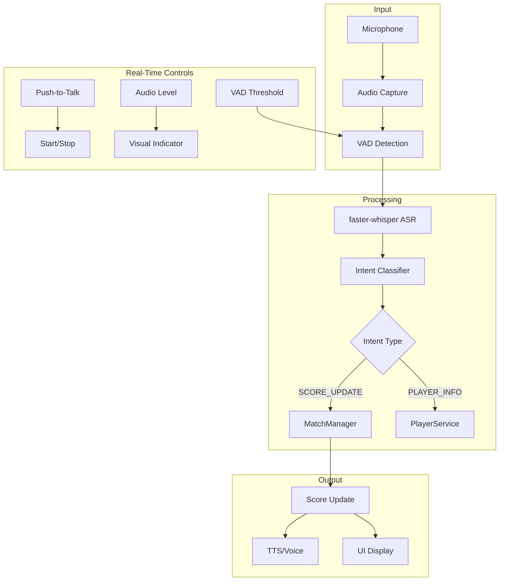

# Real-Time Voice Scorekeeper Improvements Plan

## 1. Current Voice Scorekeeper Analysis

### 1.1 Existing Implementation
The `voice_scorekeeper.py` page currently provides:
- **Voice Input**: `st.audio_input` for one-shot recording (not real-time streaming)
- **ASR**: `UmpireEngine.transcribe_audio_file()` using faster-whisper
- **Intent Parsing**: `MatchManager.update_score()` with keyword matching
- **TTS**: `pyttsx3` for offline voice feedback
- **Match Management**: Player selection, score display, match state

### 1.2 Real-Time Capabilities in UmpireEngine
The `UmpireEngine` class already has real-time infrastructure:
- `_audio_capture_loop()` - Continuous audio capture from microphone
- `_transcript_consumer()` - Queue-based transcript processing
- `start()` / `stop()` - Async pipeline control
- `_llm_process_stream()` - Streaming LLM responses
- `_tts_playback_stream()` - Streaming TTS on sentence boundaries

### 1.3 Key Gaps for Real-Time
1. **No Real-Time UI**: Uses `st.audio_input` instead of continuous listening
2. **No Intent Classification**: Uses keyword matching instead of `IntentClassifier`
3. **No Real-Time Feedback**: No live commentary during match
4. **No Audio Visualization**: No waveform or VAD indicators
5. **No Push-to-Talk**: No button to control recording state

---

## 2. Real-Time Voice Scorekeeper Enhancement Plan

### 2.1 Core Integration Points

| Component | Current | Target | File |
|-----------|---------|--------|------|
| Real-Time Audio | `st.audio_input` (one-shot) | Continuous capture with VAD | `voice_scorekeeper.py` |
| Intent Classification | Keyword matching | Use `IntentClassifier` | `voice_scorekeeper.py` |
| Real-Time Feedback | None | Live commentary during match | `umpire_engine.py` |
| Audio Controls | None | Push-to-talk, VAD threshold | `voice_scorekeeper.py` |
| State Management | Basic | Real-time session state | `voice_scorekeeper.py` |

### 2.2 Session State Additions

```python
# Add to voice_scorekeeper.py session state initialization
if 'realtime_mode' not in st.session_state:
    st.session_state.realtime_mode = False
if 'listening' not in st.session_state:
    st.session_state.listening = False
if 'audio_level' not in st.session_state:
    st.session_state.audio_level = 0.0
if 'transcript_buffer' not in st.session_state:
    st.session_state.transcript_buffer = []
if 'intent_classifier' not in st.session_state:
    st.session_state.intent_classifier = IntentClassifier()
```

---

## 3. Implementation Phases

### Phase 1: Intent Classification Integration
**Goal**: Replace keyword matching with `IntentClassifier`

**Changes to `voice_scorekeeper.py`**:
- Import `IntentClassifier` and `IntentType`
- Initialize `IntentClassifier` in session state
- Modify `process_voice_command()` to:
  1. Transcribe audio with `UmpireEngine`
  2. Classify intent with `IntentClassifier`
  3. Route to appropriate handler based on intent type

### Phase 2: Real-Time Audio Controls
**Goal**: Add push-to-talk and continuous listening

**UI Additions**:
```
🎤 Voice Scorekeeper
[Push to Talk] [Continuous Mode] ← Toggle

In Continuous Mode:
- Live audio level indicator
- VAD threshold slider
- Real-time transcript display
- Live score updates
```

### Phase 3: Real-Time UmpireEngine Integration
**Goal**: Use UmpireEngine's real-time pipeline in Streamlit

**Changes to `voice_scorekeeper.py`**:
- Add async event loop for `UmpireEngine.start()`
- Display real-time transcripts
- Show audio level visualization
- Handle real-time score updates

### Phase 4: Real-Time Feedback Display
**Goal**: Show live commentary and score updates

**Features**:
- Live transcript feed
- Score change notifications
- Audio level meter
- Session history

---

## 4. Real-Time Voice Scorekeeper Flow



---

## 5. Specific Code Changes

### 5.1 `voice_scorekeeper.py` - Real-Time Mode

```python
# Add import
from tournament_platform.multimodal_ai.intent_classifier import IntentClassifier, IntentType

# Add real-time mode toggle
col_mode1, col_mode2 = st.columns(2)
with col_mode1:
    if st.button("🎙️ Push to Talk", key="push_to_talk", use_container_width=True):
        st.session_state.listening = True
        # Trigger one-shot recording
with col_mode2:
    if st.button("🔴 Continuous", key="continuous_mode", use_container_width=True):
        st.session_state.realtime_mode = True
        st.session_state.listening = True

# Add VAD threshold control
vad_threshold = st.slider(
    "VAD Threshold",
    min_value=100,
    max_value=1000,
    value=settings.AUDIO_SILENCE_THRESHOLD,
    key="vad_threshold"
)

# Add audio level indicator
st.progress(st.session_state.audio_level, text="Audio Level")
```

### 5.2 `voice_scorekeeper.py` - Intent Integration

```python
# Modify process_voice_command
def process_voice_command(audio_bytes: bytes) -> Tuple[str, str, IntentType]:
    # Transcribe
    transcript = st.session_state.umpire_engine.transcribe_audio_file(temp_path)
    
    # Classify intent
    intent_result = st.session_state.intent_classifier.classify(transcript)
    
    if intent_result.intent_type == IntentType.SCORE_UPDATE:
        # Route to match manager
        success, response = st.session_state.match_manager.update_score(transcript)
        return transcript, response, intent_result.intent_type
    
    elif intent_result.intent_type == IntentType.PLAYER_INFO:
        # Handle player info queries
        player_name = intent_result.entities.get("player")
        if player_name:
            # Query player stats
            return transcript, f"Player {player_name} stats...", intent_result.intent_type
    
    return transcript, "Command not recognized", intent_result.intent_type
```

### 5.3 `umpire_engine.py` - Real-Time Status

```python
# Add to UmpireEngine
def get_audio_level(self) -> float:
    """Get current audio level for visualization."""
    # Return normalized audio level from last capture
    return getattr(self, '_last_audio_level', 0.0)

def set_vad_threshold(self, threshold: int) -> None:
    """Update VAD threshold dynamically."""
    self.config.silence_threshold = threshold
```

---

## 6. Real-Time Voice Commands

| Command | Intent | Entities | Action |
|---------|--------|----------|--------|
| "Player A wins point" | SCORE_UPDATE | player=Player A | Update score |
| "Game point" | SCORE_UPDATE | - | Update score |
| "Score is 10-5" | SCORE_UPDATE | score=10-5 | Update score |
| "Who is player B?" | PLAYER_INFO | player=player B | Show player stats |
| "What's the score?" | PLAYER_INFO | - | Show current score |

---

## 7. Testing Strategy

### 7.1 Unit Tests
- `test_intent_routing.py`: Test intent classification routing
- `test_realtime_audio.py`: Test audio capture and VAD
- `test_score_updates.py`: Test real-time score updates

### 7.2 Integration Tests
- Voice command to score update end-to-end
- Real-time mode toggle
- VAD threshold adjustment

### 7.3 Acceptance Criteria
1. Push-to-talk button triggers one-shot recording
2. Continuous mode captures audio in real-time
3. Intent classification routes commands correctly
4. Score updates appear in real-time
5. Audio level indicator shows input level

---

## 8. Code Mode Handoff Checklist

- [ ] Import `IntentClassifier` in `voice_scorekeeper.py`
- [ ] Add `realtime_mode` and `listening` session state
- [ ] Modify `process_voice_command()` to use intent classification
- [ ] Add push-to-talk and continuous mode buttons
- [ ] Add VAD threshold slider
- [ ] Add audio level progress indicator
- [ ] Integrate `UmpireEngine` real-time status
- [ ] Create test fixtures for real-time voice commands
- [ ] Add real-time score update display